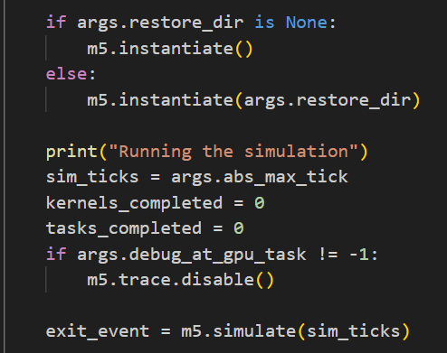

# 1.    GPU相关代码结构

```
仿真脚本configs/example/gpufs/xx.py
├── 定义参数设置函数 addXXOptions
│   ├── 设置 参数名+默认值+帮助信息
│   └── 命令行中可以直接修改参数
├── 调用构建函数，来自system.py/amdgpu.py
|   ├── 实例化一些类（组件）并连接
|   ├── 利用参数给类的成员赋值（配置组件）
│   ├── 类的定义来自于src/gpu-sompute/GPU.py
│   |   ├── 类名
│   |   ├── 对应的C函数
│   │   └── 成员【会以参数的形式传递给C】
└── └── 对应的C函数就是底层的实现
```

## 1.1  仿真脚本

* 仿真脚本：负责**整个系统的搭建**[参数设置]+**仿真整体流程控制**

  * `addXXOption`是GEM5中一类很重要的函数，例如 `addRunFSOptions` `addCommonOptions` `addAmdGPUOptions`等，它们会在仿真脚本 `main`函数中被调用
  * 这类函数包含多个 `add_argument`函数，用于设置参数
    * `add_argument`设置参数名，种类，默认值，以及帮助信息
    * 名为"--A-B"的参数，应以"args.A_B"使用
* 核心配置文件：`configs/example/gpufs/runfs.py`

  * 定义了 `addRunFSOptions`

    

    * 包含了一些基本参数
      | 参数名                | 含义           | 默认值         |
      | --------------------- | -------------- | -------------- |
      | restore-dir           | 检查点恢复目录 |                |
      | disk-image            | 启动磁盘镜像   |                |
      | kernel                | LINUX内核      |                |
      | gpu-device            | GPU模型        | Vega10(gfx900) |
      | skip-until-gpu-kernel | 跳过的内核     | 0              |
    * 例如restore-dir，disk-image，kernel，gpu-topology，exit-after-gpu-kernel等
  * 定义了一个入口函数 `runGpuFSSystem`

    * 该函数写死了一些默认值，这些值是用户不可更改的
      * 例如 `args.num_sqc = int(math.ceil(float(n_cu) / args.cu_per_sqc))`
    * 会被 `configs/example/gpufs`中其他仿真文件，例如 `mi300.py` `mi200.py`等调用
      * 这些仿真文件会设置自己特定硬件的参数
      * 例如cpu_type gpu_device num_compute_units等等
    * 调用 `makeGpuFSSystem`构建系统
    * 构建root
    * 运行仿真

    
* `configs/example/gpufs/amd/AmdGPUOptions`下的 `addAmdGPUOptions`

  * 包含了CU相关的最常用的参数
    | 参数名              | 含义                             | 默认值       |
    | ------------------- | -------------------------------- | ------------ |
    | num-compute-units   | CU数量                           | 4            |
    | num-cp              | Command Processors数量           | 0            |
    | cu-per-sqc          | 共享一个SQC的CU数量              | 4            |
    | simds-per-cu        | 一个CU包含的SIMD核心数           | 4            |
    | wf-size             | wavefront包含线程数              | 64           |
    | glbmem-wr-bus-width | VGPR-coalescer->主存字节数       | 32           |
    | vreg-file-size      | 每个SIMD核心物理向量寄存器数     | 2048         |
    | issue-period        | 每条向量指令需要的发射周期数     | 4            |
    | wfs-per-simd        | 一个SIMD核心管理的Wavefronts数量 | 10           |
    | lds-size            | shared memory大小                | 64KB         |
    | CUExecPolicy        | Wavefronts调度策略               | OLDEST-FIRST |
* 系统配置文件：`configs/example/gpufs/system.py`

  * 定义了 `makeGpuFSSystem`，根据args完成系统构建
    * 构建CPU
    * 构建GPU（GEM5中称为shader），连接到南桥

      * GPU在GEM5中编号=cpu的数量

      ```python
      shader_idx = args.num_cpus
      system.cpu.append(shader)
      ```
    * 构建GPUDispatcher、GPUCommandProcessor、AMDGPUInterruptHandler等
    * TODO：根据此函数可以很好的了解整个系统的构建
* GPU构建文件：`configs/example/gpufs/amdgpu.py`

  * `createGPU`
    - 根据参数实例化 `args.num_compute_units`数量的CU
      - 构建 `simds_per_cu`个SIMD核心
        1. 确定寄存器分配策略
           1. 有静态和动态两种分配策略
        2. 分配Vrf/Srf
        3. 分配管理的wavefronts
  * `connectGPU`
    - 挂载 GPU 设备
      - 将 GPU 挂载在 PCI 总线 `0`，设备号 `8`，功能号 `0`。
    - 识别和配置设备
      - 根据 `args.gpu_device` 的字符串判断来设置 Device ID 和 Vendor 信息。
      - 若为未知 GPU 类型则抛出 panic
    - 配置 PCIe capability 列表
      - 指定 capability offset 为 `0x80`，并设置类型为 `0x10`（即 PCI Express）。
    - 支持 PCIe 原子操作
      - 设置 PXCAPDevCap2 的第 7 和 8 位，支持 32-bit 与 64-bit 原子操作。
      - 设置 PXCAPDevCtrl2 的第 6 位，表示该设备可以作为 requester 发起原子操作。

# 2.    总体架构：Shader


- Shader
  - CU：`cuList`计算部件
  - CP：`gpuCmdProc`负责workgroup的派发

## 2.1  CP

`gpu_command_processor.cc`


- runtime 创建了软件HSA队列 `hsa_queue.hh`
  - 队列中的每一项是一个AQL包 `hsa_packet.hh`，包含kernel资源要求/大小/代码指针
- 调度流程
  1. **HSAPP**收到一个AQL包并解析完成后，调用 `submitDispatchPkt`函数把包交给**CP**
  2. **CP**收集任务所有相关信息
     1. ?
     2. 读取kernel代码：主机端DMA读取，设备端用TimingRead
     3. 调用 `dispatchKernelObject`函数：
        1. 根据信息构建task结构
        2. 调用 `initABI`函数：
           1. 管理GPU内核启动所需的内存和资源
           2. 调用 `dispatchPacket`函数，由**Dispatcher**负责调度任务

### 2.1.1.  HSAPacketProcessor

`src/dev/hsa/`目录下

### 2.1.2.  GPUDispatcher

`dispatcher.cc`


- `dispatch`函数：
  1. 将**CP**传过来的task推进队列**hsaQueue**中
  2. 这个队列中的task会被调度
- `exec`函数：每个tick都会执行
  1. 选择最早进入队列的任务
  2. 若该任务有未完成的**WGs**，尝试调度到一个**CU**上执行 `dispatchWorkgroups`
     1. 检查CU是否有足够的资源：WF slots/GPRs/LDS
     2. 若无法调度，重新入队等待
- **CU**会在执行一个WG之后通知**Dispatcher**，若该WG是task中最后一个，则会通知CPU以及HSAPP执行完成

## 2.2  CU


1. **静态信息 `compute_unit.hh`**：
   ```C++

   流水级划分：
   FetchStage fetchStage;
   ScoreboardCheckStage scoreboardCheckStage;
   ScheduleStage scheduleStage;
   ExecStage execStage;
   GlobalMemPipeline globalMemoryPipe;
   LocalMemPipeline localMemoryPipe;
   ScalarMemPipeline scalarMemoryPipe;

   管理Wavefronts上下文：
   std::vector<std::vector<Wavefront*>> wfList;
   ```

---

2. **动态执行信息 `compute_unit.cc`**：

- **Dispatcher**调用 `dispatchWorkgroups`之后，若有合适的CU，则相应CU会执行 `dispWorkgroup`

  - 遍历**CU**里所有的WF槽，若有空位且当前有需要schedule的WF则 `startWavefront`
    - `startWavefront`：
      1. 挂接PC到WF槽
      2. WF槽状态设置为**S_RUNNING**
      3. 产生的效果是Fetch_unit会为该WF槽取指
- `exec`函数

  

### 2.2.1.  FETCH1 & WAVEFRONT


1. **静态信息 `fetch_stage.hh` `fetch_unit.hh` `wavefront.hh`**

- 4个CU共享1个SQC：可配置
- 取指模块**Fetch_stage**

  - 每个SIMD core分配一个**fetch_unit，内有**

    - fetchBuf：10个FetchBufDesc
      - fetch_depth：每个wf可缓存的-cache行数，默认为2(cache_line大小应该是64B)
      - decoder
    - fetchStatusQueue：10个[wf:bool]，bool值为true → 表示WF ready2fetch 且 已经压入fetchQueue
    - fetchQueue：待被调度的取指队列，一个WF在生命周期内会不断地从压入或弹出该队列
- WF上下文

  - 每个SIMD管理10个，包含
    - PC以及对应的decoded指令
    - 寄存器和LDS分配
  - 需要4周期执行1条SIMD指令

---

2. 动态信息 `fetch_stage.cc` ``fetch_unit.cc`` `wavefront.cc`

* 取指部分 `exec`函数：

  1. 检查fetch_buf每个wf对应的表项，尝试释放空位&将指令**译码 `decodeInsts`**
  2. 检查每个WF，满足以下条件则：进入fetchQueue && 标记为true
     1. 已经dispatched：S_RUNNING
     2. ready2fetch：fetchBuf对应表项有空位 && 没有stopFetch && 没有pendingFetch
  3. fetchScheduler.chooseWave从fetchQueue中调度一个可被取指的WF
     * 调度策略：oldest-first和round-robin
     * 该WF会被标记为false，pendingFetch拉高，同时从FetchQueue中出队
     * `initiateFetch`
       1. 计算vaddr：根据已经buffered的PC计算得出
       2. 访问tlb，得到paddr：这里sqcTLB是共享的，有可能会pending【TODO：有关timingreq的机制还需要好好了解，并且看看白皮书有没有对这里的ITLB进行说明：组合逻辑？】/1747149310440.png)
       3. 得到paddr后 `fetch`
* `fetch`函数：

  * `sqcPort.sendTimingReq`
  * `ComputeUnit::SQCPort::recvTimingResp(PacketPtr pkt)`
    * `computeUnit->handleSQCReturn(pkt);`
    * `_fetchUnit[simdId].processFetchReturn(pkt);`
    * `FetchUnit::FetchBufDesc::fetchDone(PacketPtr pkt)`

### 2.2.2.  DECODE2 & ISSUE34

/1747575669948.png)

* `2FetchUnit::FetchBufDesc::decodeInsts()`

  * `wavefront->instructionBuffer.push_back(gpu_dyn_inst);`
* `3ScoreboardCheckStag::exec`:

  * 遍历所有 `wf`槽
  * `ready`:检查该wavefront `指令buffer`中的指令是否就绪
  * 若就绪，则 `_readyWFs[func_unit_id].push_back(wf)`
    * 这个数据结构是 `toSchedule`中的一员，会在下一周期被schedule模块使用
    * 保存了不同功能单元对应的readyWFs
      * globalMem/localMem/scalarMem/SIMD/scalarAlu
* `3ScoreboardCheckStag::ready`:

  * 取出 `instructionBuffer`中第一条指令：
  * 只要满足以下所有条件，该 Wavefront 才被认为“ready”，返回 `true` 并设置 `*exeResType` 为执行单元类型：
    1. 当前 Wavefront 没在：
       * 等待 `waitcnt`
       * 等待 `sleep`
       * 等待 barrier（同步屏障）
       * `STOPPED` / `RETURNING` / `STALLED` 状态
    2. 指令 buffer 里不空，且 `nextInstr()` 不为空
    3. 指令是合法的（`isALU`, `isLoad`, `isBranch`, …）
    4. 所需的 VGPR / SGPR 操作数已经 ready：如果某个寄存器在被写，则不ready
    5. 如果是 `S_ENDPGM`（程序结束指令），隐含执行 `S_WAITCNT 0`，也需要等所有旧指令执行完
    6. 如果是 MFMA（矩阵指令），需要等 matrix core 可用
    7. 最后设置 `*exeResType = mapWaveToExeUnit(w)`，表示准备在哪种执行单元上运行（ALU / LOAD / …）
  * /1747576748341.png)
* `4ScheduleStage::exec()`：遍历CU中的所有部件

  * 如果某WF已有一条正在读寄存器的指令，就不允许该WF后续指令发射：从就绪队列中删除
  * 尝试添加一个Wavefront的指令进入**某一部件的调度队列** `schlist`:
    * `Wavefront*wf=scheduler[j].chooseWave();`：越老的wfDynId越优先
    * 尝试 `addToSchList`：该wf对应的寄存器文件是否 `canScheduleReadOperands`（看起来是恒true）
      * `schList.at(exeType).push_back(std::make_pair(gpu_dyn_inst, RFBUSY));`：寄存器读取结束后这里的状态才会被置为 `SCHREADY`
    * 优先遍历 VMEM 类型的 wave：考虑到VRF的读取限制（这里很奇怪，竟然还没有实现相应的限制）
      * `for (intj=firstMemUnit; j<=lastMemUnit; j++)`
      * scalar mem 的调度优先级在 VMEM 之后

### 2.2.4.  ReadOperands

/1747581044943.png)
