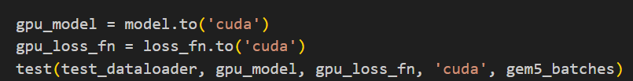
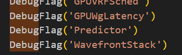
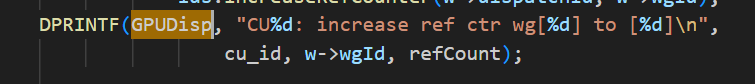

# 基于Docker开发gem5


## SE模式
1.  获取docker镜像

   `docker pull gcr.io/gem5-test/gcn-gpu:v21-2`

   * 服务器内需要注册一下github容器账号并登录
2. 在容器内编译gem5

   `git clone https://github.com/gem5/gem5.git`

   `cd gem5`

   `git clone https://github.com/gem5/gem5-resources.git`

   `docker run -u $UID:$GUID --volume $(pwd):$(pwd) -w $(pwd) gcr.io/gem5-test/gcn-gpu:v21-2 scons build/VEGA_X86/gem5.opt -j 16`启动容器并编译gem5 VEGA_X86模型

   * 若需要使用VSCODE链接docker，可以使用 `docker run --name gem5-gcn-test --privileged -it --volume $(pwd):$(pwd) -w $(pwd) gcr.io/gem5-test/gcn-gpu:v21-2`这个启动命令
3. 在容器内编译gpu程序

   `cd gem5-resources/src/gpu/square && make -j16`
   得到可执行文件在当前目录的bin下
4. 在容器内运行gem5

   gem5目录下运行（注意修改square的路径）
   `./build/VEGA_X86/gem5.opt ./configs/example/apu_se.py -n 3 -c ./square`

   * 可以在命令行中直接修改仿真脚本 `apu_se.py`中的默认参数
   * square完成element-wise的向量乘法
5. 输出信息

   * 在目录m5out/下
     * config：包含基本配置信息
       * 脚本/命令行指定
       * --num-compute-units
       * --mem-req-latency
       * --vreg-file-size(per Simt core)
       * 例如有几个CPU，每个CU包含几个SIMT-core等
     * stats.txt下包含了很多profiling工具中无法得到的统计信息
       * shaderActiveTicks:GPU中所有CU活跃的周期数
       * system.tcp_cntrl0.L1cache：各个CU L1cache的命中情况
       * ldsBankConflictDist：LDS bank conflict
       * coalescedAccesses：coalesced accessed数量
       * vALUUtilization：ALU利用

## FS模式

1. 与SE模式下相同

   `docker pull ghcr.io/gem5/gpu-fs`:拉取镜像，内含合适的编译工具

   `git clone https://github.com/gem5/gem5.git`

   `cd gem5`

   `git clone https://github.com/gem5/gem5-resources.git`

   `docker run --name gem5-fs --privileged -it --volume $(pwd):$(pwd) -w $(pwd) ghcr.io/gem5/gpu-fs`:运行容器
2. 制作磁盘镜像和内核
   `apt install qemu-system-x86`:制作需要用到qemu工具
   `cd gem5-resources/src/x86-ubuntu-gpu-ml && ./build.sh`：调用packer和QEMU，生成一个包含完整Ubuntu系统、GPU驱动（如ROCm）和依赖库的磁盘映像文件（x86-ubuntu-gpu-ml）
3. 编译Gem5
   Gem5根目录下 `scons build/VEGA_X86/gem5.opt -j 16`
4. 编译应用程序 `cd gem5-resources/src/gpu/square && make -f Makefile.default`

   * 可以使用 `hipcc my_gpu_app.cpp -o my_gpu_app --offload-arch=gfx90a,gfx942`编译自己的程序
5. 测试应用程序 `./build/VEGA_X86/gem5.opt ./configs/example/gpufs/mi300.py --disk-image ./gem5-resources/src/x86-ubuntu-gpu-ml/disk-image/x86-ubuntu-gpu-ml --kernel ./gem5-resources/src/x86-ubuntu-gpu-ml/vmlinux-gpu-ml --app ./gem5-resources/src/gpu/square/bin.default/square.default`

   * 指定仿真脚本 磁盘镜像 内核 应用程序
     * 应用程序也可以是python脚本 `--app pytorch_test.py`
6. 查看输出

   * gem5的输出在终端
   * 模拟的shell的输出在 `m5out/system.pc.com_1.device`
     * 可以链接端口查看
       * `cd ./util/term && make`
       * open a new terminal while gem5 running
       * `./util/term/m5tern <port>`

* **注** 使用官方提供的docker镜像编译gem5会出现版本问题
  * 该docker镜像主要是用于用特定版本的rocm编译程序，实际上构建镜像/内核，以及编译Gem5并不一定需要使用该镜像
  * 原因是该镜像使用的是ubuntu22.04，其内置的两个动态链接库不符合Gem5要求的版本
    * libpython3.8.so.1.0：

      ```
      下载Python 3.8的deb包（适用于Ubuntu 20.04，兼容22.04）
      wget http://archive.ubuntu.com/ubuntu/pool/main/p/python3.8/python3.8_3.8.10-0ubuntu1~20.04.8_amd64.deb
      wget http://archive.ubuntu.com/ubuntu/pool/main/p/python3.8/libpython3.8_3.8.10-0ubuntu1~20.04.8_amd64.deb
      wget http://archive.ubuntu.com/ubuntu/pool/main/p/python3.8/libpython3.8-dev_3.8.10-0ubuntu1~20.04.8_amd64.deb
      安装依赖
      apt-get install -f ./python3.8_3.8.10-0ubuntu1~20.04.8_amd64.deb \
                     ./libpython3.8_3.8.10-0ubuntu1~20.04.8_amd64.deb \
                     ./libpython3.8-dev_3.8.10-0ubuntu1~20.04.8_amd64.deb
      ```
    * libprotobuf.so.17

      * 无法修复，暂时从ubuntu20.04中把原装的复制过来

### 检查点的恢复与创建

* workload源文件中

  * 增加头文件导入
    ```
    #include "gem5/m5ops.h" 
    #include <m5_mmap>
    ```
  * main函数中
    * 增加 `m5op_addr = 0xFFFF0000` `map_m5_mem`初始化FS模式下需要使用到的变量
    * 感兴趣的代码片段前加上 `m5_checkpoint_addr()`
      * 不能在GPU kernel内部创建
* Makefile中增加

  ```
  GEM5_PATH = /home/intern/luot/gem5
  CXXFLAGS += -I\$(GEM5_PATH)/include
  CXXFLAGS += –I\$(GEM5_PATH)/util/m5/src
  LDFLAGS  += -I$(GEM5_PATH)/util/m5/build/x86/out –lm5
  ```
* 使用 `--checkpoint-dir`指定保存检查点的目录

  ```
  build/VEGA_X86/gem5.opt configs/example/gpufs/mi300.py --disk-image gem5-resources/src/x86-ubuntu-gpu-ml/disk-image/x86-ubuntu-gpu-ml --kernel gem5-resources/src/x86-ubuntu-gpu-ml/vmlinux-gpu-ml --app gem5-resources/src/gpu/square/bin.default/square.default --checkpoint-dir square-cpt
  ```

  * 原理类似于进程的上下文切换，保存了
    1. 所有寄存器的值
    2. TLB表项
    3. HSA队列状态 TODO:hsa_queue.hh
    4. packet处理单元状态
    5. GPU显存内容、cache内容
* 使用 `--restore-dir`从特定目录下恢复

### 运行Pytorch

* 代码

  * `git clone https://github.com/abmerop/gem5-pytorch`
  * 提供了gem5版本的简化pytorch代码，已适配模拟环境
    * 减少了batch数目
    * 使用了fast-forward技术
      1. --skip-until-gpu-kernel
         * gem5在GPUCommandProcessor中跟踪每一个kernel的lauchID
           * 仅作形式上的enqueue，但不执行模拟动作
         * 若有数据依赖，则结果不可信
      2. --use-kvm
         * 利用主机的KVM技术先用真CPU跑某一部分
         * 需要在代码中显式控制
           
* 运行一个简单测试程序

  ```
  ./build/VEGA_X86/gem5.opt -d pytorch_out ./configs/example/gpufs/mi200.py --disk-image gem5-resources/src/x86-ubuntu-gpu-ml/disk-image/x86-ubuntu-gpu-ml --kernel gem5-resources/src/x86-ubuntu-gpu-ml/vmlinux-gpu-ml --app ./gem5-pytorch/pytorch_test.py
  ```
* 运行MNIST测试
  直接运行会报错：gem5仿真的镜像内无法下载数据集

  1. 从网上下载数据集，内含 `train-images-idx3-ubyte.gz`等四个文件，将其解压到 `data/FashionMNIST/raw`(自行创建)
  2. 拷贝到挂载的目录下（挂载方法参见下方）:
     ```
     cp -r data mnt/root/
     ```
  3. 有3种程序可以运行
     ```
     推理1个batch
     ./build/VEGA_X86/gem5.opt –d mnist-out ./configs/example/gpufs/mi200.py --disk-image gem5-resources/src/x86-ubuntu-gpu-ml/disk-image/x86-ubuntu-gpu-ml --kernel gem5-resources/src/x86-ubuntu-gpu-ml/vmlinux-gpu-ml --app gem5-pytorch/MNIST/test_1batch/pytorch_qs_mnist.py

     训练1个batch
     ./build/VEGA_X86/gem5.opt –d mnist-out2 ./configs/example/gpufs/mi200.py --disk-image gem5-resources/src/x86-ubuntu-gpu-ml/disk-image/x86-ubuntu-gpu-ml --kernel gem5-resources/src/x86-ubuntu-gpu-ml/vmlinux-gpu-ml --app gem5-pytorch/MNIST/train_1batch/pytorch_qs_mnist.py

     CPU训练+GPU推理
     ./build/VEGA_X86/gem5.opt –d mnist-out3 ./configs/example/gpufs/mi200.py --disk-image gem5-resources/src/x86-ubuntu-gpu-ml/disk-image/x86-ubuntu-gpu-ml --kernel gem5-resources/src/x86-ubuntu-gpu-ml/vmlinux-gpu-ml --app gem5-pytorch/MNIST/kvm-ff/pytorch_qs_mnist.py
     ```
* 挂载文件方法

  * GPUFS脚本只能复制单个文件
    * `-app`会将文件拷贝入/root/下自动运行
  * 可以挂载磁盘镜像，将files拷贝进入镜像内
    * 数据 参数 模型源码

  ```
  git clone git@github.com:gem5bootcamp/2024.git
  cd ./2024/
  mkdir mnt
  将一个包含文件系统的磁盘镜像文件挂载到目录，从而像访问普通目录一样访问镜像里的文件系统内容
  mount -o loop,offset=$((2048*512)) ../gem5-resources/src/x86-ubuntu-gpu-ml/disk-image/x86-ubuntu-gpu-ml mnt
  cp -r ../gem5-pytorch/nanoGPT/nanoGPT-ff/ mnt/root/
  ```
* 运行nanoGPT

  * 结构小巧，适合在gem5模拟器中运行
  * 但模拟一次完整的训练或推理过程仍非常耗时
    * 生成token的速度可以忍受
      * TODO:推理

  ```
  ./build/VEGA_X86/gem5.opt -d tutorial_nanogpt --debug-flags=GPUCommandProc ./configs/example/gpufs/mi200.py --disk-image gem5-resources/src/x86-ubuntu-gpu-ml/disk-image/x86-ubuntu-gpu-ml --kernel gem5-resources/src/x86-ubuntu-gpu-ml/vmlinux-gpu-ml --app ./gem5-pytorch/nanoGPT/train-ff.sh --skip-until-gpu-kernel=8 --exit-after-gpu-kernel=9 
  ```

## DEBUG-FLAGS查看

* 可以通过运行 `./build/VEGA_X86/gem5.opt --debug-help`查看可用的debug标志
* 也可以进入 `gem5/src/gpu-compute/SConscript`中查看可用的debug标志
  * 可以自定义新的debug标志
    * 在sconscript中加入新标志

      
    * 在源码中使用标志
    
      
* 运行仿真时通过 `debug-flags=`指定标志
  * 默认输出在标准输出，可以通过 `debug-file=`指定具体目录
* 通过debug标志可以很好的学习GPU运行时每一周期发生的事情
  * GEM5是离散事件驱动的仿真器
