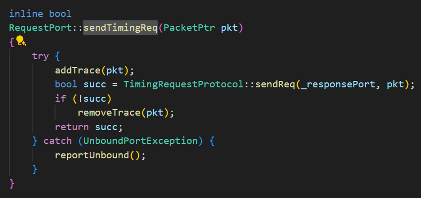

# GEM5 内存系统

* packet
* request
* port

## Packet

* 成员

| 成员 | req     | cmd     | data | addr | size |
| ---- | ------- | ------- | ---- | ---- | ---- |
| 类型 | Request | MemCmd  |      |      |      |
| 实参 | req     | ReadReq |      |      |      |

### senderstate：链式栈结构

* 每个包（`Packet`）里可以有一个 `SenderState`。
* 如果一个包经过多个组件，每个组件可以 **往包里“叠一层” SenderState** 。
* 它们通过 `predecessor` 指针连接起来，形成一个 **链表（栈）结构** ，这样当包返回的时候可以按顺序弹出，逐层恢复。

## Request

* 成员

| 成员 | vaddr | size            | flags      | id                        | pc   | cid       | atomic_op          |
| ---- | ----- | --------------- | ---------- | ------------------------- | ---- | --------- | ------------------ |
| 类型 | Addr  | unsigned        | Flags      | RequestorID               | Addr | ContextID | AtomicOpFunctorPtr |
| 实参 | vaddr | cacheLineSize() | INST_FETCH | computeUnit.requestorId() | 0    | 0         | null_ptr           |
| 说明 |       |                 |            | CU特有的编号              |      |           |                    |

## RequestPort

**`RequestPort`** 是一个“请求端口”，它是 Gem5 中组件对外发起访问请求的通道。比如 CPU 想读内存，必须通过 `RequestPort` 发出请求，最终到达接收端（叫 `ResponsePort`）。可以理解为：

> CPU（客户） → RequestPort（请求窗口） → ResponsePort（接待窗口） → 内存（服务员）

继承了三个协议接口（Atomic、Timing、Functional），表示这个端口支持三种不同的 **访问模式** ：

* **原子模式（Atomic）** ：不考虑并发、排队，直接一脚踩到底，返回访问延迟。
* **定时模式（Timing）** ：精确模拟带有延迟、排队、抢占等情况。
* **功能模式（Functional）** ：用于调试，不更新系统状态，只是“看”一下或“改”一下

成员变量

* `_responsePort`：对接的“接收端口”，即目标组件。
* `owner`：拥有这个端口的对象，比如 CPU、cache。

关键函数

* **bind** ：将这个 `RequestPort` 和另一个 `ResponsePort` 连在一起，相互建立连接
  * 对应到python配置文件中的赋值，例如
* **unbind** ：解绑两个端口的连接。

发送函数

* `sendAtomic`：马上生效，返回一个“估计”的延迟。
* `sendTimingReq`：发出一个带有时序模拟的请求，模拟实际系统的延迟和并发。
* `sendFunctional`：用于调试，不改变模拟状态

一次内存的请求流程：

* `RequestPort` 发送 `sendTimingReq`
  * `ResponsePort recvTimingReq`
  * `ResponsePort sendTimingResp`
    * `RequestPort` 收到 `recvTimingResp`

## 示例：CU中的Port

```c
  /** The memory port for SIMD data accesses.
     	*  Can be connected to PhysMem for Ruby for timing simulations
     	*/
    std::vector<DataPort> memPort;
    // port to the TLB hierarchy (i.e., the L1 TLB)
    std::vector<DTLBPort> tlbPort;
    // port to the scalar data cache
    ScalarDataPort scalarDataPort;
    // port to the scalar data TLB
    ScalarDTLBPort scalarDTLBPort;
    // port to the SQC (i.e. the I-cache)
    SQCPort sqcPort;
    // port to the SQC TLB (there's a separate TLB for each I-cache)
    ITLBPort sqcTLBPort;
```

### ITLBPort继承自REQUESTPORT

```c
        /**
         * here we queue all the translation requests that were
         * not successfully sent.
         */
        std::deque<PacketPtr> retries;
```

* 发送请求：sendTimingReq



* sendReq实际上会调用这个requestPort对应的responsePort的recvTimingReq
  * schedule是GEM5中最常用的调度策略：（事件发生时间，事件）

```C
if (!coalescer->probeTLBEvent.scheduled()) 
{coalescer->schedule(coalescer->probeTLBEvent,curTick() + coalescer->clockPeriod());}
```

### port的连接

* TLB port的连接来自于configs/common/GPUTLBConfig.py:
* SQC port的连接来自于config/example/gpufs/system/system.py:
