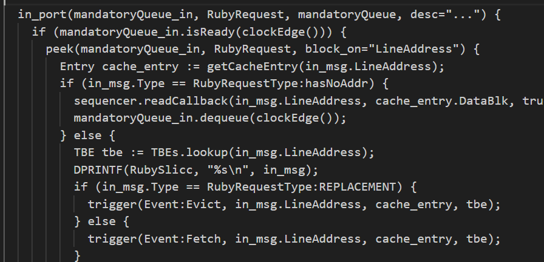
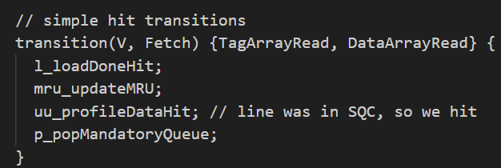
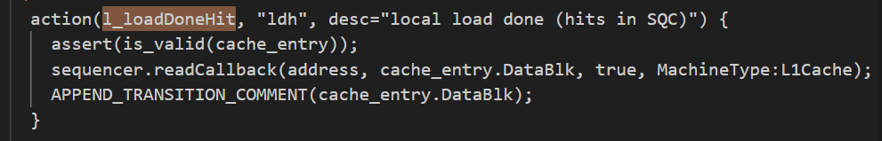

# 总体结构

**Ruby** 是 gem5 中的一个  **高级内存子系统模块** ，专门用于：

* 模拟复杂的  **缓存一致性协议** （比如 MESI、MOESI 等）
* 模拟 **多级缓存层次结构**
* 模拟  **片上互联网络（NoC）** ，通过一个叫 **Garnet** 的模型实现
* config

  * type=RubySystem
  * children

    * clk_domain power_state
    * cp_cntrl0
    * crossbars
    * dir_cntrl0
    * gpu_dir_cntrl0
    * network_cpu network_gpu
    * Cache系统：
      * tcc controller
      * scalar cache controller：0-9
      * sqc controller：0-9
      * tcp controller：0-39

## 生命周期

一个来自 gem5 中某个核心或硬件上下文的内存请求，是通过 `RubyPort::recvTiming` 接口进入 Ruby 的（该接口定义在 `src/mem/ruby/system/RubyPort.hh/cc` 文件中）。在模拟系统中，`RubyPort` 的实例数量等于硬件线程上下文的数量（对于非多线程的核心来说，就是核心的数量）。每个核心一侧都有一个端口与对应的 RubyPort 相连。

内存请求以 gem5 的 packet 形式到达，RubyPort 的职责是将其转换为 Ruby 各组件能够理解的 `RubyRequest` 对象。同时它还要检查该请求是否为某种 PIO（程序输入输出）请求，如果是，就将 packet 转发到正确的 PIO；如果确定该请求是普通内存请求（而不是 PIO 访问），则会将其交给与该 RubyPort 相连的 Sequencer 对象的 `Sequencer::makeRequest` 接口（变量 `ruby_port` 持有该对象的指针）。注意，`Sequencer` 类本身是从 `RubyPort` 派生而来的。

正如之前在介绍 Sequencer 时所说，在一个模拟系统中，Sequencer 对象的数量等于硬件线程上下文的数量（也等于系统中 RubyPort 对象的数量），每个 Sequencer 都与一个硬件线程上下文一一对应。

当一个内存请求到达 `Sequencer::makeRequest` 时，它会为这个请求进行各种统计和资源分配，然后把该请求推送到 Ruby 的一致性缓存层级中去，同时记录下该请求的服务延迟。具体而言，请求会在考虑完 L1 缓存访问延迟后被加入到 mandatory queue（变量名为 `m_mandatory_q_ptr`）中。mandatory queue 实际上起到了 Sequencer 与 SLICC 生成的一致性协议代码之间的接口作用。

L1 缓存控制器（根据一致性协议规范由 SLICC 生成）会从 mandatory queue 中取出请求，查找缓存，并进行必要的一致性状态转换，或将请求按照需要推送到更高一级的缓存层级中。不同的控制器和 SLICC 生成的 Ruby 代码组件之间通过 `MessageBuffer` 类（在 `src/mem/ruby/buffers/MessageBuffer.cc/hh` 中）来通信，该类可以充当有序或无序的缓冲队列。同时，为了模拟不同操作的延迟，系统会对 enqueue（入队）和 dequeue（出队）操作进行调度。

如果请求的缓存块在 L1 缓存中能够找到，并且具有所需的一致性权限，那么该请求会被立即满足并返回。否则，请求将通过 `MessageBuffer` 被推送到更高一级的缓存层级。一个请求可能最终会一直传递到 Ruby 的 Memory Controller（在许多协议中也被称为 Directory）那里。一旦请求被满足，它就会通过 MessageBuffers 向上返回。

MessageBuffers 也充当了一致性消息进入片上互联网络的入口。MessageBuffers 会按照指定的网络拓扑进行连接，因此一致性消息会按该片上网络拓扑传播。

一旦请求的数据块以所需的一致性权限存在于 L1 缓存中，L1 缓存控制器会调用相应的 Sequencer 对象的 `readCallback` 或 `writeCallback` 方法（取决于请求的类型）进行通知。注意，当这些方法被调用时，请求的延迟已经在前面隐式记录过了。

Sequencer 然后会清除这个请求的统计信息，并调用 `RubyPort::ruby_hit_callback` 方法。最终，该方法将请求的结果返回给 frontend（即 gem5 的核心或硬件上下文）对应的端口。

## Ruby核心组件

### 1.  **Sequencer** （请求调度器）

负责接收来自 CPU 的访存请求（load/store/atomic）并把它们转成 Ruby 的请求，进入缓存层级。

### 2.  **CacheController** （缓存结构）

cache控制器(状态机)

建模 set-associative 缓存，可以设置大小、关联度、替换策略等。

### 3.  **ReplacementPolicy** （替换策略）

目前支持 LRU 和 Pseudo-LRU，可插拔式使用。

### 4. **MemoryController**

当缓存都 miss 时，最后会走到这个控制器来模拟主存。也建模了 DRAM 延迟、刷新等细节。

这段介绍的是 gem5 模拟器中的  **Ruby 子系统** ，我们可以通俗地理解为：

## Ruby 特点

1. **支持多种一致性协议**
   * 广播式（Broadcast）
   * 目录式（Directory）
   * Token-based
   * Region-based
   * 你还可以自己添加新的协议！
2. **可替代经典 memory 模型**
   * 虽然 Ruby 与经典的 gem5 cache 不兼容，但可以通过接口将 Ruby 插入原有系统中作为替代方案。

---

## 使用 Ruby

Ruby 的核心是  **控制器（controller）** ，也叫  **状态机（state machine）** 。

这些控制器不是写成 C++ 的，而是用一种 **专门的描述语言 SLICC** 来写的。

### SLICC 是什么？

SLICC（Specification Language Including Cache Coherence）是 gem5 为描述一致性协议专门设计的语言。

* `.sm` 文件是 SLICC 文件：里面写的就是“状态”、“事件”、“条件”、“动作”
* gem5 自带一个 Python 写的 SLICC 编译器，会把这些 `.sm` 文件编译成对应的 C++ 代码，参与 gem5 最终的构建

---

### 注意

* 每次  **只能构建一个协议** ：比如想换成 `MESI_Two_Level`，需要重新编译 gem5，让它生成对应的 C++ 文件
* 默认的协议是 `MI_example`，它只是一个**教学用的性能很差的协议**

### 背景：什么是 MSI 协议？

在实现缓存一致性协议之前，你需要知道：

* **MSI 协议**是一种经典的缓存一致性协议，它的状态有 3 个：
  * **M（Modified）** ：本缓存有写权限，数据已修改，和主存不一致
  * **S（Shared）** ：多个缓存可以共享读权限，和主存一致
  * **I（Invalid）** ：无效，不能使用

📚 官方推荐你先阅读一本书：[A Primer on Memory Consistency and Cache Coherence]()，这本书详细讲了缓存一致性的各种协议。

---

### 准备：创建协议目录和配置

1. 在 gem5 的源码中建一个目录：
   <pre class="overflow-visible!" data-start="436" data-end="480">

bash

<button class="flex gap-1 items-center select-none px-4 py-1" aria-label="Copy"><svg width="24" height="24" viewBox="0 0 24 24" fill="none" xmlns="http://www.w3.org/2000/svg" class="icon-xs"><path fill-rule="evenodd" clip-rule="evenodd" d="M7 5C7 3.34315 8.34315 2 10 2H19C20.6569 2 22 3.34315 22 5V14C22 15.6569 20.6569 17 19 17H17V19C17 20.6569 15.6569 22 14 22H5C3.34315 22 2 20.6569 2 19V10C2 8.34315 3.34315 7 5 7H7V5ZM9 7H14C15.6569 7 17 8.34315 17 10V15H19C19.5523 15 20 14.5523 20 14V5C20 4.44772 19.5523 4 19 4H10C9.44772 4 9 4.44772 9 5V7ZM5 9C4.44772 9 4 9.44772 4 10V19C4 19.5523 4.44772 20 5 20H14C14.5523 20 15 19.5523 15 19V10C15 9.44772 14.5523 9 14 9H5Z" fill="currentColor"></path></svg>Copy</button><button class="flex items-center gap-1 px-4 py-1 select-none"><svg width="24" height="24" viewBox="0 0 24 24" fill="none" xmlns="http://www.w3.org/2000/svg" class="icon-xs"><path d="M2.5 5.5C4.3 5.2 5.2 4 5.5 2.5C5.8 4 6.7 5.2 8.5 5.5C6.7 5.8 5.8 7 5.5 8.5C5.2 7 4.3 5.8 2.5 5.5Z" fill="currentColor" stroke="currentColor" stroke-linecap="round" stroke-linejoin="round"></path><path d="M5.66282 16.5231L5.18413 19.3952C5.12203 19.7678 5.09098 19.9541 5.14876 20.0888C5.19933 20.2067 5.29328 20.3007 5.41118 20.3512C5.54589 20.409 5.73218 20.378 6.10476 20.3159L8.97693 19.8372C9.72813 19.712 10.1037 19.6494 10.4542 19.521C10.7652 19.407 11.0608 19.2549 11.3343 19.068C11.6425 18.8575 11.9118 18.5882 12.4503 18.0497L20 10.5C21.3807 9.11929 21.3807 6.88071 20 5.5C18.6193 4.11929 16.3807 4.11929 15 5.5L7.45026 13.0497C6.91175 13.5882 6.6425 13.8575 6.43197 14.1657C6.24513 14.4392 6.09299 14.7348 5.97903 15.0458C5.85062 15.3963 5.78802 15.7719 5.66282 16.5231Z" stroke="currentColor" stroke-width="2" stroke-linecap="round" stroke-linejoin="round"></path><path d="M14.5 7L18.5 11" stroke="currentColor" stroke-width="2" stroke-linecap="round" stroke-linejoin="round"></path></svg>Edit</button>

<code class="whitespace-pre!">src/learning_gem5/MSI_protocol
   </code>

</pre>
2. **写一个 `SConsopts` 文件** （注意不是 `SConscript`，因为我们需要先运行 SLICC 编译器）
   文件内容是：

<pre class="overflow-visible!" data-start="562" data-end="672">

python

<button class="flex gap-1 items-center select-none px-4 py-1" aria-label="Copy"><svg width="24" height="24" viewBox="0 0 24 24" fill="none" xmlns="http://www.w3.org/2000/svg" class="icon-xs"><path fill-rule="evenodd" clip-rule="evenodd" d="M7 5C7 3.34315 8.34315 2 10 2H19C20.6569 2 22 3.34315 22 5V14C22 15.6569 20.6569 17 19 17H17V19C17 20.6569 15.6569 22 14 22H5C3.34315 22 2 20.6569 2 19V10C2 8.34315 3.34315 7 5 7H7V5ZM9 7H14C15.6569 7 17 8.34315 17 10V15H19C19.5523 15 20 14.5523 20 14V5C20 4.44772 19.5523 4 19 4H10C9.44772 4 9 4.44772 9 5V7ZM5 9C4.44772 9 4 9.44772 4 10V19C4 19.5523 4.44772 20 5 20H14C14.5523 20 15 19.5523 15 19V10C15 9.44772 14.5523 9 14 9H5Z" fill="currentColor"></path></svg>Copy</button><button class="flex items-center gap-1 px-4 py-1 select-none"><svg width="24" height="24" viewBox="0 0 24 24" fill="none" xmlns="http://www.w3.org/2000/svg" class="icon-xs"><path d="M2.5 5.5C4.3 5.2 5.2 4 5.5 2.5C5.8 4 6.7 5.2 8.5 5.5C6.7 5.8 5.8 7 5.5 8.5C5.2 7 4.3 5.8 2.5 5.5Z" fill="currentColor" stroke="currentColor" stroke-linecap="round" stroke-linejoin="round"></path><path d="M5.66282 16.5231L5.18413 19.3952C5.12203 19.7678 5.09098 19.9541 5.14876 20.0888C5.19933 20.2067 5.29328 20.3007 5.41118 20.3512C5.54589 20.409 5.73218 20.378 6.10476 20.3159L8.97693 19.8372C9.72813 19.712 10.1037 19.6494 10.4542 19.521C10.7652 19.407 11.0608 19.2549 11.3343 19.068C11.6425 18.8575 11.9118 18.5882 12.4503 18.0497L20 10.5C21.3807 9.11929 21.3807 6.88071 20 5.5C18.6193 4.11929 16.3807 4.11929 15 5.5L7.45026 13.0497C6.91175 13.5882 6.6425 13.8575 6.43197 14.1657C6.24513 14.4392 6.09299 14.7348 5.97903 15.0458C5.85062 15.3963 5.78802 15.7719 5.66282 16.5231Z" stroke="currentColor" stroke-width="2" stroke-linecap="round" stroke-linejoin="round"></path><path d="M14.5 7L18.5 11" stroke="currentColor" stroke-width="2" stroke-linecap="round" stroke-linejoin="round"></path></svg>Edit</button>

<code class="whitespace-pre! language-python">Import('*')
   main.Append(ALL_PROTOCOLS=['MSI'])
   main.Append(PROTOCOL_DIRS=[Dir('.')])
   </code>

</pre>

* `ALL_PROTOCOLS`：告诉 gem5 我定义了一个新的协议，叫 `MSI`
* `PROTOCOL_DIRS`：告诉 SCons 在当前目录里找 `.sm` 文件并交给 SLICC 编译器处理

---

### SLICC 状态机文件是怎么写的？

这是协议的“核心代码”，通常包含下面几个部分：

#### 1. Parameters（参数）

定义这个协议生成的 SimObject 所需要的参数。

#### 2. 声明结构和函数

定义：

* 消息缓冲区（Mesage Buffer）
* 状态（States）
* 事件（Events）
* 数据结构（比如缓存行）

#### 3. in_port 代码块：消息->事件

* 处理  **消息入口** （比如缓存控制器收到别人的请求），决定当前消息触发什么事件
* 编译到相应的wakeup文件
* `in_port(mandatoryQueue_in, RubyRequest, mandatoryQueue, desc="...")`
  * `mandatoryQueue_in`是入口变量名，`RubyRequest`是类型，绑定的队列是 `mandatoryQueue`

#### 3. Transitions：状态 + 事件 = 新状态 + 动作

* 编译到sqc_transitions.cc

#### 4. Actions（动作）：这是核心的动作代码块

* 编译到sqc_controller.cc

这些动作是单独定义的可复用的代码块。

#### 最后

整个协议的流程大概是这样：

1. 编写多个 `.sm` 文件描述状态机（缓存控制器、目录控制器等）
2. 编写 `MSI.slicc` 汇总它们
3. 用 gem5 自带的 SLICC 编译器生成 C++ 代码
4. 编译 gem5 就会带上你的新协议

这段文档介绍的是如何在 gem5 中使用 SLICC 定义一个 MSI 缓存一致性协议的 L1 Cache 控制器。虽然内容很多，但我们可以拆解为几个关键点来通俗理解：

---

### 一、开始写我们的第一个状态机文件！

我们先来为 MSI 协议实现 L1 缓存控制器。

创建一个名为 `MSI-cache.sm` 的文件，声明如下：

<pre class="overflow-visible!" data-start="153" data-end="238">

slicc

<button class="flex gap-1 items-center select-none px-4 py-1" aria-label="Copy"><svg width="24" height="24" viewBox="0 0 24 24" fill="none" xmlns="http://www.w3.org/2000/svg" class="icon-xs"><path fill-rule="evenodd" clip-rule="evenodd" d="M7 5C7 3.34315 8.34315 2 10 2H19C20.6569 2 22 3.34315 22 5V14C22 15.6569 20.6569 17 19 17H17V19C17 20.6569 15.6569 22 14 22H5C3.34315 22 2 20.6569 2 19V10C2 8.34315 3.34315 7 5 7H7V5ZM9 7H14C15.6569 7 17 8.34315 17 10V15H19C19.5523 15 20 14.5523 20 14V5C20 4.44772 19.5523 4 19 4H10C9.44772 4 9 4.44772 9 5V7ZM5 9C4.44772 9 4 9.44772 4 10V19C4 19.5523 4.44772 20 5 20H14C14.5523 20 15 19.5523 15 19V10C15 9.44772 14.5523 9 14 9H5Z" fill="currentColor"></path></svg>Copy</button><button class="flex items-center gap-1 px-4 py-1 select-none"><svg width="24" height="24" viewBox="0 0 24 24" fill="none" xmlns="http://www.w3.org/2000/svg" class="icon-xs"><path d="M2.5 5.5C4.3 5.2 5.2 4 5.5 2.5C5.8 4 6.7 5.2 8.5 5.5C6.7 5.8 5.8 7 5.5 8.5C5.2 7 4.3 5.8 2.5 5.5Z" fill="currentColor" stroke="currentColor" stroke-linecap="round" stroke-linejoin="round"></path><path d="M5.66282 16.5231L5.18413 19.3952C5.12203 19.7678 5.09098 19.9541 5.14876 20.0888C5.19933 20.2067 5.29328 20.3007 5.41118 20.3512C5.54589 20.409 5.73218 20.378 6.10476 20.3159L8.97693 19.8372C9.72813 19.712 10.1037 19.6494 10.4542 19.521C10.7652 19.407 11.0608 19.2549 11.3343 19.068C11.6425 18.8575 11.9118 18.5882 12.4503 18.0497L20 10.5C21.3807 9.11929 21.3807 6.88071 20 5.5C18.6193 4.11929 16.3807 4.11929 15 5.5L7.45026 13.0497C6.91175 13.5882 6.6425 13.8575 6.43197 14.1657C6.24513 14.4392 6.09299 14.7348 5.97903 15.0458C5.85062 15.3963 5.78802 15.7719 5.66282 16.5231Z" stroke="currentColor" stroke-width="2" stroke-linecap="round" stroke-linejoin="round"></path><path d="M14.5 7L18.5 11" stroke="currentColor" stroke-width="2" stroke-linecap="round" stroke-linejoin="round"></path></svg>Edit</button>

<code class="whitespace-pre! language-slicc">machine(MachineType:L1Cache, "MSI cache")
    : <参数列表>
{
    <完整状态机代码>
}
</code>

</pre>

这段代码看起来和 C++ 很像。你可以把它想象成是在写一个“包含实现代码”的头文件。大多数情况下 C++ 的语法在 SLICC 中能直接使用，不过也有差别和扩展。

`MachineType:L1Cache` 表示我们在写 L1 缓存的状态机，名字是 `L1Cache`。编译这个文件后，SLICC 会自动为我们生成很多对象，例如一个叫 `L1Cache_Controller` 的 SimObject。

后面的 `"MSI cache"` 是这个状态机的描述。这个描述很重要，它既可以当注释看，也会被用于生成 HTML 表格，帮助我们调试。

---

### 二、状态机参数

冒号 `:` 后面是这个状态机的参数，这些参数会自动变成 Python SimObject 中的字段（可以在配置文件里赋值）。

<pre class="overflow-visible!" data-start="597" data-end="726">

slicc

<button class="flex gap-1 items-center select-none px-4 py-1" aria-label="Copy"><svg width="24" height="24" viewBox="0 0 24 24" fill="none" xmlns="http://www.w3.org/2000/svg" class="icon-xs"><path fill-rule="evenodd" clip-rule="evenodd" d="M7 5C7 3.34315 8.34315 2 10 2H19C20.6569 2 22 3.34315 22 5V14C22 15.6569 20.6569 17 19 17H17V19C17 20.6569 15.6569 22 14 22H5C3.34315 22 2 20.6569 2 19V10C2 8.34315 3.34315 7 5 7H7V5ZM9 7H14C15.6569 7 17 8.34315 17 10V15H19C19.5523 15 20 14.5523 20 14V5C20 4.44772 19.5523 4 19 4H10C9.44772 4 9 4.44772 9 5V7ZM5 9C4.44772 9 4 9.44772 4 10V19C4 19.5523 4.44772 20 5 20H14C14.5523 20 15 19.5523 15 19V10C15 9.44772 14.5523 9 14 9H5Z" fill="currentColor"></path></svg>Copy</button><button class="flex items-center gap-1 px-4 py-1 select-none"><svg width="24" height="24" viewBox="0 0 24 24" fill="none" xmlns="http://www.w3.org/2000/svg" class="icon-xs"><path d="M2.5 5.5C4.3 5.2 5.2 4 5.5 2.5C5.8 4 6.7 5.2 8.5 5.5C6.7 5.8 5.8 7 5.5 8.5C5.2 7 4.3 5.8 2.5 5.5Z" fill="currentColor" stroke="currentColor" stroke-linecap="round" stroke-linejoin="round"></path><path d="M5.66282 16.5231L5.18413 19.3952C5.12203 19.7678 5.09098 19.9541 5.14876 20.0888C5.19933 20.2067 5.29328 20.3007 5.41118 20.3512C5.54589 20.409 5.73218 20.378 6.10476 20.3159L8.97693 19.8372C9.72813 19.712 10.1037 19.6494 10.4542 19.521C10.7652 19.407 11.0608 19.2549 11.3343 19.068C11.6425 18.8575 11.9118 18.5882 12.4503 18.0497L20 10.5C21.3807 9.11929 21.3807 6.88071 20 5.5C18.6193 4.11929 16.3807 4.11929 15 5.5L7.45026 13.0497C6.91175 13.5882 6.6425 13.8575 6.43197 14.1657C6.24513 14.4392 6.09299 14.7348 5.97903 15.0458C5.85062 15.3963 5.78802 15.7719 5.66282 16.5231Z" stroke="currentColor" stroke-width="2" stroke-linecap="round" stroke-linejoin="round"></path><path d="M14.5 7L18.5 11" stroke="currentColor" stroke-width="2" stroke-linecap="round" stroke-linejoin="round"></path></svg>Edit</button>

<code class="whitespace-pre! language-slicc">machine(MachineType:SQC, "GPU SQC (L1 I Cache)")
 : Sequencer* sequencer;
   CacheMemory * L1cache;
   int TCC_select_num_bits;
</code>

</pre>

解释如下：

* `Sequencer`：特殊对象，用来把 CPU 的内存请求变成 Ruby 的请求，并丢进 mandatoryQueue；
* `CacheMemory`：存放实际的缓存块；
* `send_evictions`：一个布尔值，用于控制驱逐通知；

---

### 三、消息缓冲区（message buffers）

缓存控制器和 Ruby 网络通信要通过消息缓冲区。不同的通信方向和消息优先级需要不同的缓冲区。

<pre class="overflow-visible!" data-start="945" data-end="1365">

slicc

<button class="flex gap-1 items-center select-none px-4 py-1" aria-label="Copy"><svg width="24" height="24" viewBox="0 0 24 24" fill="none" xmlns="http://www.w3.org/2000/svg" class="icon-xs"><path fill-rule="evenodd" clip-rule="evenodd" d="M7 5C7 3.34315 8.34315 2 10 2H19C20.6569 2 22 3.34315 22 5V14C22 15.6569 20.6569 17 19 17H17V19C17 20.6569 15.6569 22 14 22H5C3.34315 22 2 20.6569 2 19V10C2 8.34315 3.34315 7 5 7H7V5ZM9 7H14C15.6569 7 17 8.34315 17 10V15H19C19.5523 15 20 14.5523 20 14V5C20 4.44772 19.5523 4 19 4H10C9.44772 4 9 4.44772 9 5V7ZM5 9C4.44772 9 4 9.44772 4 10V19C4 19.5523 4.44772 20 5 20H14C14.5523 20 15 19.5523 15 19V10C15 9.44772 14.5523 9 14 9H5Z" fill="currentColor"></path></svg>Copy</button><button class="flex items-center gap-1 px-4 py-1 select-none"><svg width="24" height="24" viewBox="0 0 24 24" fill="none" xmlns="http://www.w3.org/2000/svg" class="icon-xs"><path d="M2.5 5.5C4.3 5.2 5.2 4 5.5 2.5C5.8 4 6.7 5.2 8.5 5.5C6.7 5.8 5.8 7 5.5 8.5C5.2 7 4.3 5.8 2.5 5.5Z" fill="currentColor" stroke="currentColor" stroke-linecap="round" stroke-linejoin="round"></path><path d="M5.66282 16.5231L5.18413 19.3952C5.12203 19.7678 5.09098 19.9541 5.14876 20.0888C5.19933 20.2067 5.29328 20.3007 5.41118 20.3512C5.54589 20.409 5.73218 20.378 6.10476 20.3159L8.97693 19.8372C9.72813 19.712 10.1037 19.6494 10.4542 19.521C10.7652 19.407 11.0608 19.2549 11.3343 19.068C11.6425 18.8575 11.9118 18.5882 12.4503 18.0497L20 10.5C21.3807 9.11929 21.3807 6.88071 20 5.5C18.6193 4.11929 16.3807 4.11929 15 5.5L7.45026 13.0497C6.91175 13.5882 6.6425 13.8575 6.43197 14.1657C6.24513 14.4392 6.09299 14.7348 5.97903 15.0458C5.85062 15.3963 5.78802 15.7719 5.66282 16.5231Z" stroke="currentColor" stroke-width="2" stroke-linecap="round" stroke-linejoin="round"></path><path d="M14.5 7L18.5 11" stroke="currentColor" stroke-width="2" stroke-linecap="round" stroke-linejoin="round"></path></svg>Edit</button>

<code class="whitespace-pre! language-slicc">  MessageBuffer * requestFromSQC, network="To", virtual_network="1", vnet_type="request";

  MessageBuffer * probeToSQC, network="From", virtual_network="1", vnet_type="request";
  MessageBuffer * responseToSQC, network="From", virtual_network="3", vnet_type="response";

  MessageBuffer * mandatoryQueue;

</code>

</pre>

说明：

* `"To"` 表示这个控制器要发出的消息；
* `"From"` 表示它要接收的消息；
* `"virtual_network"` 是虚拟通道编号，用于避免死锁；
* `mandatoryQueue` 是特殊队列，用来接收 Sequencer 生成的初始请求（不走网络）；

---

### 四、状态声明

<pre class="overflow-visible!" data-start="1529" data-end="1836">

slicc

<button class="flex gap-1 items-center select-none px-4 py-1" aria-label="Copy"><svg width="24" height="24" viewBox="0 0 24 24" fill="none" xmlns="http://www.w3.org/2000/svg" class="icon-xs"><path fill-rule="evenodd" clip-rule="evenodd" d="M7 5C7 3.34315 8.34315 2 10 2H19C20.6569 2 22 3.34315 22 5V14C22 15.6569 20.6569 17 19 17H17V19C17 20.6569 15.6569 22 14 22H5C3.34315 22 2 20.6569 2 19V10C2 8.34315 3.34315 7 5 7H7V5ZM9 7H14C15.6569 7 17 8.34315 17 10V15H19C19.5523 15 20 14.5523 20 14V5C20 4.44772 19.5523 4 19 4H10C9.44772 4 9 4.44772 9 5V7ZM5 9C4.44772 9 4 9.44772 4 10V19C4 19.5523 4.44772 20 5 20H14C14.5523 20 15 19.5523 15 19V10C15 9.44772 14.5523 9 14 9H5Z" fill="currentColor"></path></svg>Copy</button><button class="flex items-center gap-1 px-4 py-1 select-none"><svg width="24" height="24" viewBox="0 0 24 24" fill="none" xmlns="http://www.w3.org/2000/svg" class="icon-xs"><path d="M2.5 5.5C4.3 5.2 5.2 4 5.5 2.5C5.8 4 6.7 5.2 8.5 5.5C6.7 5.8 5.8 7 5.5 8.5C5.2 7 4.3 5.8 2.5 5.5Z" fill="currentColor" stroke="currentColor" stroke-linecap="round" stroke-linejoin="round"></path><path d="M5.66282 16.5231L5.18413 19.3952C5.12203 19.7678 5.09098 19.9541 5.14876 20.0888C5.19933 20.2067 5.29328 20.3007 5.41118 20.3512C5.54589 20.409 5.73218 20.378 6.10476 20.3159L8.97693 19.8372C9.72813 19.712 10.1037 19.6494 10.4542 19.521C10.7652 19.407 11.0608 19.2549 11.3343 19.068C11.6425 18.8575 11.9118 18.5882 12.4503 18.0497L20 10.5C21.3807 9.11929 21.3807 6.88071 20 5.5C18.6193 4.11929 16.3807 4.11929 15 5.5L7.45026 13.0497C6.91175 13.5882 6.6425 13.8575 6.43197 14.1657C6.24513 14.4392 6.09299 14.7348 5.97903 15.0458C5.85062 15.3963 5.78802 15.7719 5.66282 16.5231Z" stroke="currentColor" stroke-width="2" stroke-linecap="round" stroke-linejoin="round"></path><path d="M14.5 7L18.5 11" stroke="currentColor" stroke-width="2" stroke-linecap="round" stroke-linejoin="round"></path></svg>Edit</button>

<code class="whitespace-pre! language-slicc">{
  state_declaration(State, desc="SQC Cache States", default="SQC_State_I") {
    I, AccessPermission:Invalid, desc="Invalid";
    V, AccessPermission:Read_Only, desc="Valid";
  }
</code>

</pre>

说明：

* 每个状态有一个权限（AccessPermission）；
* `I` 是无效；
* `S` 是共享（读权限）；
* `M` 是修改（读写权限）；
* 其他状态是过渡状态，比如 `IM_AD` 表示从 I 变成 M 的过程中；

---

### 五、事件声明

<pre class="overflow-visible!" data-start="1976" data-end="2163">

slicc

<button class="flex gap-1 items-center select-none px-4 py-1" aria-label="Copy"><svg width="24" height="24" viewBox="0 0 24 24" fill="none" xmlns="http://www.w3.org/2000/svg" class="icon-xs"><path fill-rule="evenodd" clip-rule="evenodd" d="M7 5C7 3.34315 8.34315 2 10 2H19C20.6569 2 22 3.34315 22 5V14C22 15.6569 20.6569 17 19 17H17V19C17 20.6569 15.6569 22 14 22H5C3.34315 22 2 20.6569 2 19V10C2 8.34315 3.34315 7 5 7H7V5ZM9 7H14C15.6569 7 17 8.34315 17 10V15H19C19.5523 15 20 14.5523 20 14V5C20 4.44772 19.5523 4 19 4H10C9.44772 4 9 4.44772 9 5V7ZM5 9C4.44772 9 4 9.44772 4 10V19C4 19.5523 4.44772 20 5 20H14C14.5523 20 15 19.5523 15 19V10C15 9.44772 14.5523 9 14 9H5Z" fill="currentColor"></path></svg>Copy</button><button class="flex items-center gap-1 px-4 py-1 select-none"><svg width="24" height="24" viewBox="0 0 24 24" fill="none" xmlns="http://www.w3.org/2000/svg" class="icon-xs"><path d="M2.5 5.5C4.3 5.2 5.2 4 5.5 2.5C5.8 4 6.7 5.2 8.5 5.5C6.7 5.8 5.8 7 5.5 8.5C5.2 7 4.3 5.8 2.5 5.5Z" fill="currentColor" stroke="currentColor" stroke-linecap="round" stroke-linejoin="round"></path><path d="M5.66282 16.5231L5.18413 19.3952C5.12203 19.7678 5.09098 19.9541 5.14876 20.0888C5.19933 20.2067 5.29328 20.3007 5.41118 20.3512C5.54589 20.409 5.73218 20.378 6.10476 20.3159L8.97693 19.8372C9.72813 19.712 10.1037 19.6494 10.4542 19.521C10.7652 19.407 11.0608 19.2549 11.3343 19.068C11.6425 18.8575 11.9118 18.5882 12.4503 18.0497L20 10.5C21.3807 9.11929 21.3807 6.88071 20 5.5C18.6193 4.11929 16.3807 4.11929 15 5.5L7.45026 13.0497C6.91175 13.5882 6.6425 13.8575 6.43197 14.1657C6.24513 14.4392 6.09299 14.7348 5.97903 15.0458C5.85062 15.3963 5.78802 15.7719 5.66282 16.5231Z" stroke="currentColor" stroke-width="2" stroke-linecap="round" stroke-linejoin="round"></path><path d="M14.5 7L18.5 11" stroke="currentColor" stroke-width="2" stroke-linecap="round" stroke-linejoin="round"></path></svg>Edit</button>

<code class="whitespace-pre! language-slicc">  enumeration(Event, desc="SQC Events") {
    // Core initiated
    Fetch,          desc="Fetch";
    // Mem sys initiated
    Repl,           desc="Replacing block from cache";
    Data,           desc="Received Data";
    Evict,          desc="Evict cache line";
  }
</code>

</pre>

这些事件会触发状态转移，比如 CPU 发出 Load/Store，或者接收到目录转发的请求（FwdGetM）等。

---

### 六、定义结构体

<pre class="overflow-visible!" data-start="2241" data-end="2371">

slicc

<button class="flex gap-1 items-center select-none px-4 py-1" aria-label="Copy"><svg width="24" height="24" viewBox="0 0 24 24" fill="none" xmlns="http://www.w3.org/2000/svg" class="icon-xs"><path fill-rule="evenodd" clip-rule="evenodd" d="M7 5C7 3.34315 8.34315 2 10 2H19C20.6569 2 22 3.34315 22 5V14C22 15.6569 20.6569 17 19 17H17V19C17 20.6569 15.6569 22 14 22H5C3.34315 22 2 20.6569 2 19V10C2 8.34315 3.34315 7 5 7H7V5ZM9 7H14C15.6569 7 17 8.34315 17 10V15H19C19.5523 15 20 14.5523 20 14V5C20 4.44772 19.5523 4 19 4H10C9.44772 4 9 4.44772 9 5V7ZM5 9C4.44772 9 4 9.44772 4 10V19C4 19.5523 4.44772 20 5 20H14C14.5523 20 15 19.5523 15 19V10C15 9.44772 14.5523 9 14 9H5Z" fill="currentColor"></path></svg>Copy</button><button class="flex items-center gap-1 px-4 py-1 select-none"><svg width="24" height="24" viewBox="0 0 24 24" fill="none" xmlns="http://www.w3.org/2000/svg" class="icon-xs"><path d="M2.5 5.5C4.3 5.2 5.2 4 5.5 2.5C5.8 4 6.7 5.2 8.5 5.5C6.7 5.8 5.8 7 5.5 8.5C5.2 7 4.3 5.8 2.5 5.5Z" fill="currentColor" stroke="currentColor" stroke-linecap="round" stroke-linejoin="round"></path><path d="M5.66282 16.5231L5.18413 19.3952C5.12203 19.7678 5.09098 19.9541 5.14876 20.0888C5.19933 20.2067 5.29328 20.3007 5.41118 20.3512C5.54589 20.409 5.73218 20.378 6.10476 20.3159L8.97693 19.8372C9.72813 19.712 10.1037 19.6494 10.4542 19.521C10.7652 19.407 11.0608 19.2549 11.3343 19.068C11.6425 18.8575 11.9118 18.5882 12.4503 18.0497L20 10.5C21.3807 9.11929 21.3807 6.88071 20 5.5C18.6193 4.11929 16.3807 4.11929 15 5.5L7.45026 13.0497C6.91175 13.5882 6.6425 13.8575 6.43197 14.1657C6.24513 14.4392 6.09299 14.7348 5.97903 15.0458C5.85062 15.3963 5.78802 15.7719 5.66282 16.5231Z" stroke="currentColor" stroke-width="2" stroke-linecap="round" stroke-linejoin="round"></path><path d="M14.5 7L18.5 11" stroke="currentColor" stroke-width="2" stroke-linecap="round" stroke-linejoin="round"></path></svg>Edit</button>

<code class="whitespace-pre! language-slicc">  structure(Entry, desc="...", interface="AbstractCacheEntry") {
    State CacheState,           desc="cache state";
    bool Dirty,                 desc="Is the data dirty (diff than memory)?";
    DataBlock DataBlk,          desc="data for the block";
    bool FromL2, default="false", desc="block just moved from L2";
  }
</code>

</pre>

表示缓存块的内容：状态 + 数据。

<pre class="overflow-visible!" data-start="2392" data-end="2528">

slicc

<button class="flex gap-1 items-center select-none px-4 py-1" aria-label="Copy"><svg width="24" height="24" viewBox="0 0 24 24" fill="none" xmlns="http://www.w3.org/2000/svg" class="icon-xs"><path fill-rule="evenodd" clip-rule="evenodd" d="M7 5C7 3.34315 8.34315 2 10 2H19C20.6569 2 22 3.34315 22 5V14C22 15.6569 20.6569 17 19 17H17V19C17 20.6569 15.6569 22 14 22H5C3.34315 22 2 20.6569 2 19V10C2 8.34315 3.34315 7 5 7H7V5ZM9 7H14C15.6569 7 17 8.34315 17 10V15H19C19.5523 15 20 14.5523 20 14V5C20 4.44772 19.5523 4 19 4H10C9.44772 4 9 4.44772 9 5V7ZM5 9C4.44772 9 4 9.44772 4 10V19C4 19.5523 4.44772 20 5 20H14C14.5523 20 15 19.5523 15 19V10C15 9.44772 14.5523 9 14 9H5Z" fill="currentColor"></path></svg>Copy</button><button class="flex items-center gap-1 px-4 py-1 select-none"><svg width="24" height="24" viewBox="0 0 24 24" fill="none" xmlns="http://www.w3.org/2000/svg" class="icon-xs"><path d="M2.5 5.5C4.3 5.2 5.2 4 5.5 2.5C5.8 4 6.7 5.2 8.5 5.5C6.7 5.8 5.8 7 5.5 8.5C5.2 7 4.3 5.8 2.5 5.5Z" fill="currentColor" stroke="currentColor" stroke-linecap="round" stroke-linejoin="round"></path><path d="M5.66282 16.5231L5.18413 19.3952C5.12203 19.7678 5.09098 19.9541 5.14876 20.0888C5.19933 20.2067 5.29328 20.3007 5.41118 20.3512C5.54589 20.409 5.73218 20.378 6.10476 20.3159L8.97693 19.8372C9.72813 19.712 10.1037 19.6494 10.4542 19.521C10.7652 19.407 11.0608 19.2549 11.3343 19.068C11.6425 18.8575 11.9118 18.5882 12.4503 18.0497L20 10.5C21.3807 9.11929 21.3807 6.88071 20 5.5C18.6193 4.11929 16.3807 4.11929 15 5.5L7.45026 13.0497C6.91175 13.5882 6.6425 13.8575 6.43197 14.1657C6.24513 14.4392 6.09299 14.7348 5.97903 15.0458C5.85062 15.3963 5.78802 15.7719 5.66282 16.5231Z" stroke="currentColor" stroke-width="2" stroke-linecap="round" stroke-linejoin="round"></path><path d="M14.5 7L18.5 11" stroke="currentColor" stroke-width="2" stroke-linecap="round" stroke-linejoin="round"></path></svg>Edit</button>

<code class="whitespace-pre! language-slicc">structure(TBE, desc="Entry for transient requests") {
    State TBEState;
    DataBlock DataBlk;
    int AcksOutstanding;
}
</code>

</pre>

TBE 是事务缓冲项（类似 MSHR），用于存储正在处理中但未完成的请求。

<pre class="overflow-visible!" data-start="2569" data-end="2670">

slicc

<button class="flex gap-1 items-center select-none px-4 py-1" aria-label="Copy"><svg width="24" height="24" viewBox="0 0 24 24" fill="none" xmlns="http://www.w3.org/2000/svg" class="icon-xs"><path fill-rule="evenodd" clip-rule="evenodd" d="M7 5C7 3.34315 8.34315 2 10 2H19C20.6569 2 22 3.34315 22 5V14C22 15.6569 20.6569 17 19 17H17V19C17 20.6569 15.6569 22 14 22H5C3.34315 22 2 20.6569 2 19V10C2 8.34315 3.34315 7 5 7H7V5ZM9 7H14C15.6569 7 17 8.34315 17 10V15H19C19.5523 15 20 14.5523 20 14V5C20 4.44772 19.5523 4 19 4H10C9.44772 4 9 4.44772 9 5V7ZM5 9C4.44772 9 4 9.44772 4 10V19C4 19.5523 4.44772 20 5 20H14C14.5523 20 15 19.5523 15 19V10C15 9.44772 14.5523 9 14 9H5Z" fill="currentColor"></path></svg>Copy</button><button class="flex items-center gap-1 px-4 py-1 select-none"><svg width="24" height="24" viewBox="0 0 24 24" fill="none" xmlns="http://www.w3.org/2000/svg" class="icon-xs"><path d="M2.5 5.5C4.3 5.2 5.2 4 5.5 2.5C5.8 4 6.7 5.2 8.5 5.5C6.7 5.8 5.8 7 5.5 8.5C5.2 7 4.3 5.8 2.5 5.5Z" fill="currentColor" stroke="currentColor" stroke-linecap="round" stroke-linejoin="round"></path><path d="M5.66282 16.5231L5.18413 19.3952C5.12203 19.7678 5.09098 19.9541 5.14876 20.0888C5.19933 20.2067 5.29328 20.3007 5.41118 20.3512C5.54589 20.409 5.73218 20.378 6.10476 20.3159L8.97693 19.8372C9.72813 19.712 10.1037 19.6494 10.4542 19.521C10.7652 19.407 11.0608 19.2549 11.3343 19.068C11.6425 18.8575 11.9118 18.5882 12.4503 18.0497L20 10.5C21.3807 9.11929 21.3807 6.88071 20 5.5C18.6193 4.11929 16.3807 4.11929 15 5.5L7.45026 13.0497C6.91175 13.5882 6.6425 13.8575 6.43197 14.1657C6.24513 14.4392 6.09299 14.7348 5.97903 15.0458C5.85062 15.3963 5.78802 15.7719 5.66282 16.5231Z" stroke="currentColor" stroke-width="2" stroke-linecap="round" stroke-linejoin="round"></path><path d="M14.5 7L18.5 11" stroke="currentColor" stroke-width="2" stroke-linecap="round" stroke-linejoin="round"></path></svg>Edit</button>

<code class="whitespace-pre! language-slicc">structure(TBETable, external="yes") {
  TBE lookup(Addr);
  void allocate(Addr);
  ...
}
</code>

</pre>

TBETable 是用于存放 TBE 的表，它由 C++ 提供实现，我们只在这里声明。

---

### 七、一些辅助变量和函数

我们需要一些通用的辅助函数，比如：

<pre class="overflow-visible!" data-start="2758" data-end="2904">

slicc

<button class="flex gap-1 items-center select-none px-4 py-1" aria-label="Copy"><svg width="24" height="24" viewBox="0 0 24 24" fill="none" xmlns="http://www.w3.org/2000/svg" class="icon-xs"><path fill-rule="evenodd" clip-rule="evenodd" d="M7 5C7 3.34315 8.34315 2 10 2H19C20.6569 2 22 3.34315 22 5V14C22 15.6569 20.6569 17 19 17H17V19C17 20.6569 15.6569 22 14 22H5C3.34315 22 2 20.6569 2 19V10C2 8.34315 3.34315 7 5 7H7V5ZM9 7H14C15.6569 7 17 8.34315 17 10V15H19C19.5523 15 20 14.5523 20 14V5C20 4.44772 19.5523 4 19 4H10C9.44772 4 9 4.44772 9 5V7ZM5 9C4.44772 9 4 9.44772 4 10V19C4 19.5523 4.44772 20 5 20H14C14.5523 20 15 19.5523 15 19V10C15 9.44772 14.5523 9 14 9H5Z" fill="currentColor"></path></svg>Copy</button><button class="flex items-center gap-1 px-4 py-1 select-none"><svg width="24" height="24" viewBox="0 0 24 24" fill="none" xmlns="http://www.w3.org/2000/svg" class="icon-xs"><path d="M2.5 5.5C4.3 5.2 5.2 4 5.5 2.5C5.8 4 6.7 5.2 8.5 5.5C6.7 5.8 5.8 7 5.5 8.5C5.2 7 4.3 5.8 2.5 5.5Z" fill="currentColor" stroke="currentColor" stroke-linecap="round" stroke-linejoin="round"></path><path d="M5.66282 16.5231L5.18413 19.3952C5.12203 19.7678 5.09098 19.9541 5.14876 20.0888C5.19933 20.2067 5.29328 20.3007 5.41118 20.3512C5.54589 20.409 5.73218 20.378 6.10476 20.3159L8.97693 19.8372C9.72813 19.712 10.1037 19.6494 10.4542 19.521C10.7652 19.407 11.0608 19.2549 11.3343 19.068C11.6425 18.8575 11.9118 18.5882 12.4503 18.0497L20 10.5C21.3807 9.11929 21.3807 6.88071 20 5.5C18.6193 4.11929 16.3807 4.11929 15 5.5L7.45026 13.0497C6.91175 13.5882 6.6425 13.8575 6.43197 14.1657C6.24513 14.4392 6.09299 14.7348 5.97903 15.0458C5.85062 15.3963 5.78802 15.7719 5.66282 16.5231Z" stroke="currentColor" stroke-width="2" stroke-linecap="round" stroke-linejoin="round"></path><path d="M14.5 7L18.5 11" stroke="currentColor" stroke-width="2" stroke-linecap="round" stroke-linejoin="round"></path></svg>Edit</button>

<code class="whitespace-pre! language-slicc">Entry getCacheEntry(Addr address), return_by_pointer="yes" {
    return static_cast(Entry, "pointer", cacheMemory.lookup(address));
}
</code>

</pre>

用于查找缓存条目。

还要实现一些虚函数，例如：

<pre class="overflow-visible!" data-start="2932" data-end="3059">

slicc

<button class="flex gap-1 items-center select-none px-4 py-1" aria-label="Copy"><svg width="24" height="24" viewBox="0 0 24 24" fill="none" xmlns="http://www.w3.org/2000/svg" class="icon-xs"><path fill-rule="evenodd" clip-rule="evenodd" d="M7 5C7 3.34315 8.34315 2 10 2H19C20.6569 2 22 3.34315 22 5V14C22 15.6569 20.6569 17 19 17H17V19C17 20.6569 15.6569 22 14 22H5C3.34315 22 2 20.6569 2 19V10C2 8.34315 3.34315 7 5 7H7V5ZM9 7H14C15.6569 7 17 8.34315 17 10V15H19C19.5523 15 20 14.5523 20 14V5C20 4.44772 19.5523 4 19 4H10C9.44772 4 9 4.44772 9 5V7ZM5 9C4.44772 9 4 9.44772 4 10V19C4 19.5523 4.44772 20 5 20H14C14.5523 20 15 19.5523 15 19V10C15 9.44772 14.5523 9 14 9H5Z" fill="currentColor"></path></svg>Copy</button><button class="flex items-center gap-1 px-4 py-1 select-none"><svg width="24" height="24" viewBox="0 0 24 24" fill="none" xmlns="http://www.w3.org/2000/svg" class="icon-xs"><path d="M2.5 5.5C4.3 5.2 5.2 4 5.5 2.5C5.8 4 6.7 5.2 8.5 5.5C6.7 5.8 5.8 7 5.5 8.5C5.2 7 4.3 5.8 2.5 5.5Z" fill="currentColor" stroke="currentColor" stroke-linecap="round" stroke-linejoin="round"></path><path d="M5.66282 16.5231L5.18413 19.3952C5.12203 19.7678 5.09098 19.9541 5.14876 20.0888C5.19933 20.2067 5.29328 20.3007 5.41118 20.3512C5.54589 20.409 5.73218 20.378 6.10476 20.3159L8.97693 19.8372C9.72813 19.712 10.1037 19.6494 10.4542 19.521C10.7652 19.407 11.0608 19.2549 11.3343 19.068C11.6425 18.8575 11.9118 18.5882 12.4503 18.0497L20 10.5C21.3807 9.11929 21.3807 6.88071 20 5.5C18.6193 4.11929 16.3807 4.11929 15 5.5L7.45026 13.0497C6.91175 13.5882 6.6425 13.8575 6.43197 14.1657C6.24513 14.4392 6.09299 14.7348 5.97903 15.0458C5.85062 15.3963 5.78802 15.7719 5.66282 16.5231Z" stroke="currentColor" stroke-width="2" stroke-linecap="round" stroke-linejoin="round"></path><path d="M14.5 7L18.5 11" stroke="currentColor" stroke-width="2" stroke-linecap="round" stroke-linejoin="round"></path></svg>Edit</button>

<code class="whitespace-pre! language-slicc">State getState(TBE tbe, Entry cache_entry, Addr addr)
void setState(...)
AccessPermission getAccessPermission(...)
</code>

</pre>

这些用于获取和设置缓存块状态和权限，SLICC 会调用这些函数来决定是否转移状态、是否访问缓存等。

---
