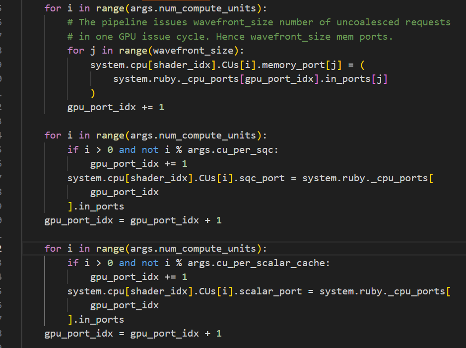
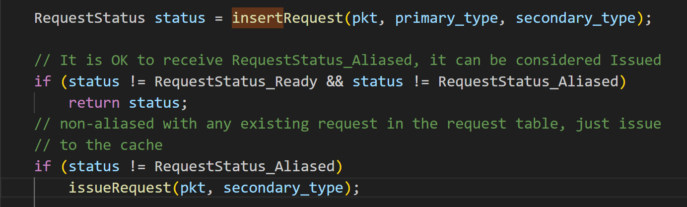

# SQC：GPU的L1-ICache

## GPU与Ruby系统的连接

* Ruby系统给GPU提供了端口ruby_cpu_ports：
  * 每个CU一个，该端口包含64(WF线程数)个子端口
  * 每个sqc 一个，该端口包含4(共享SQC的CU数)个子端口
  * 每个scalar_cache 一个
  * 每个CP 两个

`example/gpufs/system/py`：



* 通过代码层层回溯，找明这个system.ruby_cpu_ports的定义比较麻烦：`example/gpufs/Disjoint_VIPER.py`

  * 他是多个 `sequencer`组成的列表：`all_sequencers = (cp_sequencers + tcp_sequencers + sqc_sequencers + scalar_sequencers)`

    * 其中sqc： `(sqc_sequencers, sqc_cntrl_nodes) = construct_sqcs`
    * `self.sequencer = VIPERSequencer()`
    * **VIPERSequencer继承自Sequncer，继承自Rubyport**

      ```cpp
      class SQCCntrl(GPU_VIPER_SQC_Controller, CntrlBase):
          def create(self, options, ruby_system, system):
              self.version = self.versionCount()

              self.L1cache = SQCCache()
              self.L1cache.create(options)
              self.L1cache.resourceStalls = options.no_resource_stalls

              self.sequencer = VIPERSequencer()
      ```
* 从config.ini中可以直接查看对应端口的连线：[system.ruby.sqc_cntrl0.sequence]

## Response

* Rubyport下面有 `std::vector<MemResponsePort *> response_ports;`

  * 对应python里的 `in_ports`

### `MemResponsePort`：recvTimingReq

**接收 Timing 模式的请求包** ，决定是否提交给 Ruby memory system，如果成功提交就返回 `true`，否则放入 retry 队列并返回 `false`。

1. 调用 `Sequencer::makeRequest`

<pre class="overflow-visible!" data-start="1763" data-end="1957"><div class="contain-inline-size rounded-md border-[0.5px] border-token-border-medium relative bg-token-sidebar-surface-primary"><div class="flex items-center text-token-text-secondary px-4 py-2 text-xs font-sans justify-between h-9 bg-token-sidebar-surface-primary dark:bg-token-main-surface-secondary select-none rounded-t-[5px]">arduino</div><div class="sticky top-9"><div class="absolute end-0 bottom-0 flex h-9 items-center pe-2"><div class="bg-token-sidebar-surface-primary text-token-text-secondary dark:bg-token-main-surface-secondary flex items-center rounded-sm px-2 font-sans text-xs"><button class="flex gap-1 items-center select-none py-1" aria-label="Copy"><svg width="24" height="24" viewBox="0 0 24 24" fill="none" xmlns="http://www.w3.org/2000/svg" class="icon-sm"><path fill-rule="evenodd" clip-rule="evenodd" d="M7 5C7 3.34315 8.34315 2 10 2H19C20.6569 2 22 3.34315 22 5V14C22 15.6569 20.6569 17 19 17H17V19C17 20.6569 15.6569 22 14 22H5C3.34315 22 2 20.6569 2 19V10C2 8.34315 3.34315 7 5 7H7V5ZM9 7H14C15.6569 7 17 8.34315 17 10V15H19C19.5523 15 20 14.5523 20 14V5C20 4.44772 19.5523 4 19 4H10C9.44772 4 9 4.44772 9 5V7ZM5 9C4.44772 9 4 9.44772 4 10V19C4 19.5523 4.44772 20 5 20H14C14.5523 20 15 19.5523 15 19V10C15 9.44772 14.5523 9 14 9H5Z" fill="currentColor"></path></svg>Copy code</button></div></div></div><div class="overflow-y-auto p-4" dir="ltr"><code class="whitespace-pre!"><span><span>CPU 请求
   ↓
Sequencer::makeRequest
   ├─ 是否太忙？是→返回 BufferFull
   ├─ 判定请求类型 primary/secondary
   ├─ 是否与已有请求冲突？是→返回 Aliased
   ├─ 插入请求表
   ├─ 加入 mandatoryQueue（等待 SLICC 处理）
   └─ 返回 Issued
</span></span></code></div></div></pre>

2. `IssueRequest`

   **主要是把req加入到 mandatory queue：m_mandatory_q_ptr->enqueue(msg, clockEdge(), latency)**

   * m_mandatory_q_ptr：类型是MessageBuffer，这个指针会关联到对应的AbstractController下边
   * ```C
     m_prio_heap.push_back(message);
     push_heap(m_prio_heap.begin(), m_prio_heap.end(), std::greater<MsgPtr>());
     ```
   * 会推送到一个 按触发cycle排序的队列里，后续peek时peek最年轻的一个
     * 根据operator定义：触发cycle相等时，getMsgCounter越小顺序越小
   * 延迟定义：src\mem\ruby\protocol\GPU_VIPER-SQC.sm
     * 这个sm文件里有SQC的实现方式
       * 往上层找 BankedArray::BankedArray(unsignedintbanks, Cycles accessLatency, unsigned int startIndexBit)
     * 配置文件configs\ruby\GPU_VIPER.py里有L1Cache相关参数的定义
   * ```python
       // L1 hit latency
       Cycles mandatoryQueueLatency(RubyRequestType type) {
         if (type == RubyRequestType:IFETCH) {
           return L1Icache.getTagLatency();
         } else {
           return L1Dcache.getTagLatency();
         }
       }

       // Latency for responses that fetch data from cache
       Cycles cacheResponseLatency() {
         if (L1Dcache.getTagLatency() > response_latency) {
           return L1Dcache.getTagLatency();
         } else {
           return response_latency;
         }
       }
     ```
3. `MessageBuffer::enqueue`调用 `m_consumer->scheduleEventAbsolute`

   * `m_consumer`其实就是m_mandatory_q_ptr对应的controller本身：`getMemReqQueue()->setConsumer(this);`
   * `m_consumer->scheduleEventAbsolute(arrival_time);`
     1. m_wakeup_ticks中加入该事件对应的tick
     2. 从m_wakeup_ticks选出一个最早的
     3. 调用 `wakeup()`：GEM5中事件调度机制
        * 在 `src/mem/ruby/protocol/GPU_VIPER-SQC.sm`中定义
        * 编译后在 `mem/ruby/protocol/GPU_VIPER/.cc`
4. wakeup： `L1Cache`控制器会从**mandatory queue** 取出 `Req`

   * 每次取队头的req：队内按延迟排队
   * 一个 `bank `只允许同时处理1个 `req`
   * 可以找到，就返回
   * 否则 `Req`通过 `MessageBuffer` 被推送到 `L2`
     * 有可能一直传递到 `Memory Controller`（在许多协议中也被称为 Directory）
5. `L1Cache`会调用 `doTransition`：若命中，调用相应的  `Sequencer `对象的 `readCallback `或 `writeCallback` 方法（取决于请求的类型）进行通知
6. Sequencer 会清除这个请求的统计信息，并调用 `RubyPort::ruby_hit_callback` 方法。最终，该方法会遍历 `m_RequestTable[address]` 上挂起的所有 CPU 请求，处理所有的请求

### `SQC_Controller::wakeup()`

#### 关键点说明

* `wakeup()` 是在 **每个时钟周期**被调度执行的事件处理函数；
* 它最多允许 `m_transitions_per_cycle` 次状态转换（以避免死循环）；
* **三种 in_port** 处理顺序：
  1. `responseToSQC_in`: 处理返回的数据响应；
  2. `mandatoryQueue_in`: 来自 sequencer 的请求，如 fetch、replacement；
* 每个消息都会触发对应的 `doTransition(Event, Entry, TBE, Addr)`；
* `TransitionResult` 决定是否成功、资源阻塞或协议 stall；
* 成功的 transition 会更新状态机并继续处理下一个消息。

#### 流程图

<pre class="overflow-visible!" data-start="189" data-end="1875"><div class="contain-inline-size rounded-md border-[0.5px] border-token-border-medium relative bg-token-sidebar-surface-primary"><div class="flex items-center text-token-text-secondary px-4 py-2 text-xs font-sans justify-between h-9 bg-token-sidebar-surface-primary dark:bg-token-main-surface-secondary select-none rounded-t-[5px]">text</div><div class="sticky top-9"><div class="absolute end-0 bottom-0 flex h-9 items-center pe-2"><div class="bg-token-sidebar-surface-primary text-token-text-secondary dark:bg-token-main-surface-secondary flex items-center rounded-sm px-2 font-sans text-xs"><button class="flex gap-1 items-center select-none px-4 py-1" aria-label="Copy"><svg width="24" height="24" viewBox="0 0 24 24" fill="none" xmlns="http://www.w3.org/2000/svg" class="icon-xs"><path fill-rule="evenodd" clip-rule="evenodd" d="M7 5C7 3.34315 8.34315 2 10 2H19C20.6569 2 22 3.34315 22 5V14C22 15.6569 20.6569 17 19 17H17V19C17 20.6569 15.6569 22 14 22H5C3.34315 22 2 20.6569 2 19V10C2 8.34315 3.34315 7 5 7H7V5ZM9 7H14C15.6569 7 17 8.34315 17 10V15H19C19.5523 15 20 14.5523 20 14V5C20 4.44772 19.5523 4 19 4H10C9.44772 4 9 4.44772 9 5V7ZM5 9C4.44772 9 4 9.44772 4 10V19C4 19.5523 4.44772 20 5 20H14C14.5523 20 15 19.5523 15 19V10C15 9.44772 14.5523 9 14 9H5Z" fill="currentColor"></path></svg>Copy</button><span class="" data-state="closed"><button class="flex items-center gap-1 px-4 py-1 select-none"><svg width="24" height="24" viewBox="0 0 24 24" fill="none" xmlns="http://www.w3.org/2000/svg" class="icon-xs"><path d="M2.5 5.5C4.3 5.2 5.2 4 5.5 2.5C5.8 4 6.7 5.2 8.5 5.5C6.7 5.8 5.8 7 5.5 8.5C5.2 7 4.3 5.8 2.5 5.5Z" fill="currentColor" stroke="currentColor" stroke-linecap="round" stroke-linejoin="round"></path><path d="M5.66282 16.5231L5.18413 19.3952C5.12203 19.7678 5.09098 19.9541 5.14876 20.0888C5.19933 20.2067 5.29328 20.3007 5.41118 20.3512C5.54589 20.409 5.73218 20.378 6.10476 20.3159L8.97693 19.8372C9.72813 19.712 10.1037 19.6494 10.4542 19.521C10.7652 19.407 11.0608 19.2549 11.3343 19.068C11.6425 18.8575 11.9118 18.5882 12.4503 18.0497L20 10.5C21.3807 9.11929 21.3807 6.88071 20 5.5C18.6193 4.11929 16.3807 4.11929 15 5.5L7.45026 13.0497C6.91175 13.5882 6.6425 13.8575 6.43197 14.1657C6.24513 14.4392 6.09299 14.7348 5.97903 15.0458C5.85062 15.3963 5.78802 15.7719 5.66282 16.5231Z" stroke="currentColor" stroke-width="2" stroke-linecap="round" stroke-linejoin="round"></path><path d="M14.5 7L18.5 11" stroke="currentColor" stroke-width="2" stroke-linecap="round" stroke-linejoin="round"></path></svg>Edit</button></span></div></div></div><div class="overflow-y-auto p-4" dir="ltr"><code class="whitespace-pre! language-text"><span><span>                                ┌───────────────────────┐
                                  │ SQC_Controller::wakeup│
                                  └────────────┬──────────┘
                                               │
                            ┌──────────────────┴─────────────────┐
                            │检查 memory request queue 是否就绪   │
                            └─────┬──────────────────────────────┘
                                  │是：调用 serviceMemoryQueue()
                                  ↓
                      ┌─────────────────────────────┐
                      │进入主循环 (while true)      │
                      │最多处理 m_transitions_per_cycle 次 │
                      └────────────┬────────────────┘
                                   ↓
                ┌──────────────────────────────────────┐
                │Step 1: 处理 responseToSQC_in         │
                │ 若 ready 且为 ResponseMsg:           │
                │  - 类型为 TDSysResp                  │
                │     • 若 L1 有空位或已有 entry，则执行 "Data" 转换│
                │     • 否则执行 "Replacement" 转换    │
                └──────────────┬───────────────────────┘
                               ↓
                ┌──────────────────────────────────────┐
                │Step 2: 处理 mandatoryQueue_in        │
                │ 若 ready 且为 RubyRequest:           │
                │  - 类型为 hasNoAddr：直接 callback   │
                │  - 类型为 REPLACEMENT：执行 Evict 转换│
                │  - 其他：执行 Fetch 转换              │
                └──────────────────────────────────────┘

                    ↑       ↑        ↑
       若任何 step 中 doTransition 成功则 counter++
       否则根据 stall 类型 scheduleEvent(Cycles(1))

  如果达到最大转换数 → scheduleEvent(Cycles(1)) 提前退出
  </span></span></code></div></div></pre>

## hitCallback

* sequence.hitcallback()就是 Ruby 完成一个请求（比如 load），然后：
  * 决定是否要返回数据给 CPU；
  * 根据请求类型执行必要的数据操作；
  * 更新数据 block 或使用数据 block 响应 CPU；
  * 最后释放请求资源或记录 trace 用于 warmup/cooldown。
* ruby_hit_callback:将 Ruby 处理完的 pkt（请求包）送回 CPU 或设备，并调用上层 port->hitCallback(pkt) 进行数据回写或通知完成。
* port.hitCallback:判断是否需要访问物理内存或发送响应，如果需要就访问内存或构造响应，然后把响应包送回 CPU，否则释放掉这个包。
* port.schedTimingResp
  * PacketQueue::schedSendTiming
  * 层层调用会来到`sendTimingResp`

---
