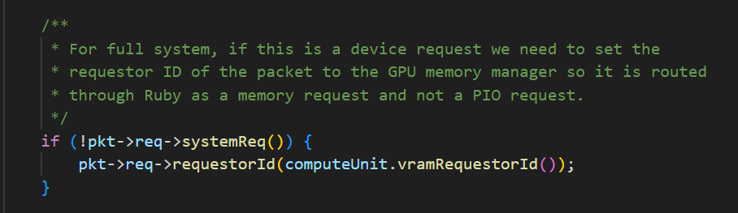

# TLB请求

```c
// set up virtual request  
RequestPtr req = std::make_shared<Request>(
        vaddr, computeUnit.cacheLineSize(), Request::INST_FETCH,
        computeUnit.requestorId(), 0, 0, nullptr);

PacketPtr pkt = new Packet(req, MemCmd::ReadReq);
```

* 构建req，构建pkt
* pkt->senderstate：1WF 2 `GpuTranslationState`
* send:

  * coalescer_cpuside:recv
  * coadlescer_memside:send
    * tlb_cpuside:recv
    * tlb_cpu:send
  * coadlescer_memside:recv
  * coalescer_cpuside:send
* recv：调用fetch()

  * 
  * 在 **gem5** 模拟器的全系统（Full System）模式下，**请求（Request）** 分为系统请求（`systemReq()` 为真，目的地是host mem）和设备请求（非系统请求，目的地是device mem）
  * 如果是设备请求，设置该请求的  **requestor ID** （请求者ID）为 CU.VRAM 请求者ID；
  * 这个 ID 告诉系统这个请求要去 GPU VRAM ，从而确保请求被正确路由到  **Ruby内存系统** （gem5中对内存系统的建模）作为内存请求处理，而不是普通的PIO（程序输入输出）请求
