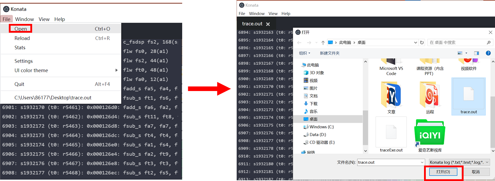
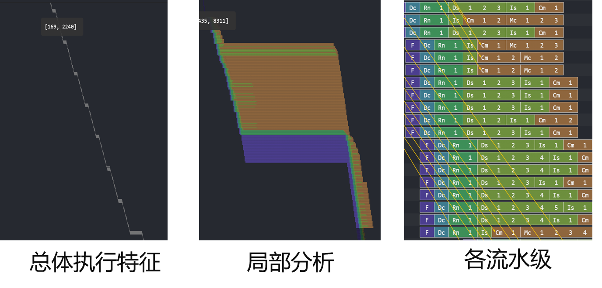
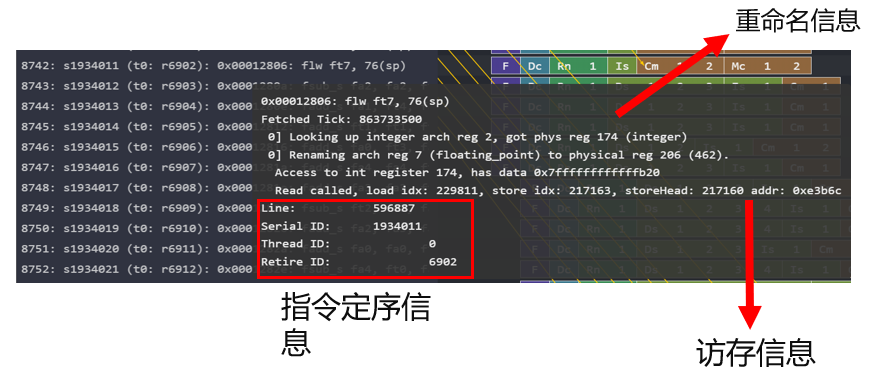
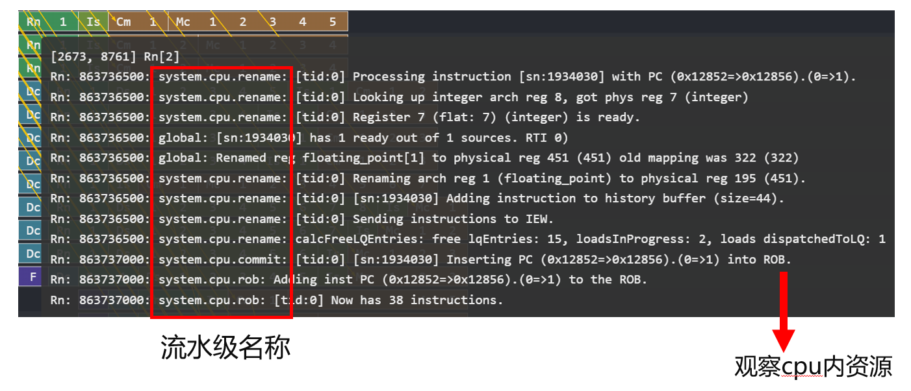

# BASIC

* 目前Gem5支持minor(顺序)和O3(乱序)CPU模型的trace可视化
  * GPU模型是否支持有待调研

## 使用方法1：Gem5官方脚本可视化O3CPU

1.  首先运行仿真得到trace，这一步得到的trace可直接文本查看 
    ./build/ARM/gem5.opt --debug-flags=O3PipeView --debug-start=<first tick of interest> --debug-file=trace.out configs/deprecated/example/se.py --cpu-type=detailed --caches -c \<path to binary\> -m \<last cycle of interest\>
    * `./build/ARM/gem5.opt`是编译好的gem5模型
      * 可在gem5根目录下运行`scons build/{ISA}/gem5.{variant} -j {cpus}`根据需求编译gem5模型
        * {variant}包括debug、opt、fast
    * `--debug-flags`指定debug标志
    * `--debug-file`指定输出debug信息的文件，该文件默认在gem5/m5out路径下
    * `configs/deprecated/example/se.py`是仿真脚本，configs/路径下有官方提供的很多仿真脚本
    * `--cpu-type`指定CPU模型
      * 这里指定CPU为RiscvO3CPU
2.  运行脚本，使用上面的trace生成一个类似的trace
    * `./util/o3-pipeview.py -o pipeview.out --color m5out/trace.out`
    * 该脚本完成对第一步生成trace格式的一些调整，便于可视化  
3.  `less -r pipeview.out`即可可视化

*   MinorCPU可视化脚本官方已经很久没有维护

## 使用方法2：安装Konata插件可视化O3CPU（推荐）

1.  安装
    1.  从官网直接下载可执行文件（推荐）：https://github.com/shioyadan/Konata/releases
    2.  使用源码安装：
        1.  参考 https://nodejs.org 安装 node.js
        2.  克隆仓库：git clone git@github.com:shioyadan/Konata.git
        3.  运行 install.bat (Windows) 或 install.sh (Linux/MacOS).
        4.  运行 Konata ：konata.vbs (Windows) 或 konata.sh (Linux/MacOS).
2.  使用
    1.  生成trace.out，具体参考第一种方法第一步
    2.  直接使用安装好的软件打开trace.out
        
        1. 使用鼠标滚轮可实现页面自由缩放：
        
        2. 鼠标悬停左侧指令处，展示指令静态信息：
        
        3. 第一步仿真时在debug标志中加上O3CPUALL`--debug-flags=O3PipeView,O3CPUALL`，可查看更多细节，如动态执行信息 
        
        
        

