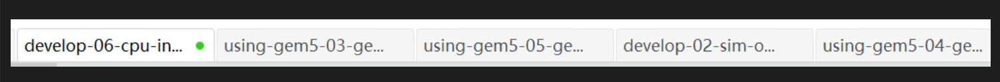

gem5网课与进一步学习

* gem5的课程以及官网教程，有需要时使用【不过直接上网查也ok】

1. 官网教程

   1. doc/debugging ckpt tracing_cpu statics
2. 我看那几个PPT可能有比较重要的部分

   1. 06中有详细的ISA相关，可查；还有训练，可练；还有个assembler没看懂
   2. 03slide27有m5动态编译的东西
   3. 02最后有访存发包啥的，前面是simObject【可以结合rvv.pdf去理解事件驱动编程】
   4. 降序
