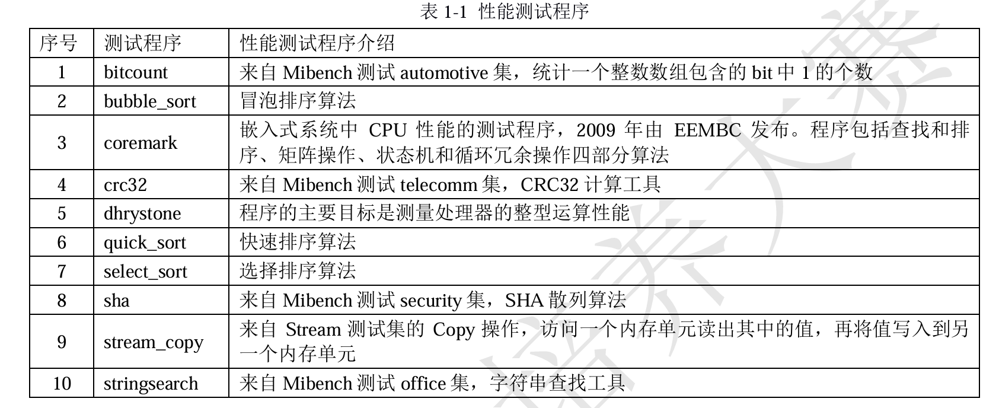

* 冰山模型

  * 架构与芯片本身只是冰山水面上的部分，而敏捷**开发基础设施是冰山水下的部分，是支撑水面上香山架构得以不断迭代演进的关键**
* 功能验证+仿真调试+性能评估

  * 基于规则的敏捷验证方法
  * 基于checkpoint的敏捷仿真调试方法
* 硬件验证

  * 基于参考模型
  * 协同仿真&在线错误检查
* verilator vs VIVADO_XSIM

  * verilator极快
    * 编译型+周期驱动
      * V代码转换为高性能C++源码
      * 不模拟所有电平变换事件
    * 解释性+事件驱动，天生几十倍的性能差距
      * 默认集成波形/调试面板/调度器-开销大
  * verilator集成度不如XSIM，入门门槛较高，但灵活
    * 需要自己写C++ testbench
    * 可以和外部程序集合（例如模拟器/自定义trace文件）
  * verilator适合大规模系统
    * 启动LINUX
      * vivado基于TRACE不能比较内存数据，store的错通过load体现出来可能已经过了很久
      * golden_trace特别大，难以回溯，并且无法读入TODO
* ### HITD

  * 比对

    * 通用寄存器
    * HILO寄存器
    * CP0寄存器
    * 内存数据
  * 生成

    * 波形文件-fst/vcd
    * log文件
      * MTRACE
        * 定位一个导致错误load 的store，可能在时间和波形上十分遥远。
        * 但是通过查找MTRACE的地址，可以迅速定位到错误的store。
      * AXI_TRACE
        * 从波形中解放，直接由log查看AXI事务
  * 使用方法

    * 差分测试系统其实就是一个仿真verilog代码的testbench工程，它通过使用
      verilator 将 verilog写的 CPU 编译成cpp文件，再和工程中仿真的内存，串口等外设
      编译链接，生成可执行elf。
    * 该elf会仿真V代码的CPU，将其指令提交结果与CPU模拟器nemu执行结果进行比对
      * 从而达到实时Assert的结果
    * 获取V代码写的CPU中的指令提交结果的方法是使用verilator提供的DPIC函数，在V代码中
      * 使用这些函数，仿真主循环中就可以获取CPU退休数量/退休PC/通用寄存器/物理寄存器位置等信息
        * 从而进行比较：根据退休数量让模拟器往前执行指令，进行比较
        * 物理寄存器位置的检查：物理寄存器只会存在于freelist/recover队列/rob
          * 实际上仿真模型那边不需要实现重命名机制，只需要建立一些数据结构对物理寄存器位置进行分析
            * 三个列表，用物理寄存器号索引，计数
            * count=32？是否有重复出现？
              * 若则比较新旧表，检查错误物理寄存器
          * 这就是用规则描述设计行为范围
  * 性能导向优化

    * 在仿真主循环中，记录每条指令的 PC、提交周期/耗费周期数/是否跳转指令。
    * 仿真结束后，将所有数据结构化地写入一个二进制文件中。
    * 通过一个 Python 脚本读取 `.bin` 文件，构建基本块模型（以 delay slot 为切分点）
      * 计算每个块的平均 IPC、运行时间和占比，提取热点 block
        * 有好几个benchmark的主循环占据了很大时间，
        * 可以针对性地对代码段进行分析优化
      * 最后我们输出文本报告和可视化图像，用于辅助性能调优和 pipeline 分析
  * 总结

    * Linux系统下的cpp工程，依赖verilator编译verilog生成cpp语言的电路仿真代码。
    * 仿真速度远大于Xilinx的EDA，大大减少了debug的时间。
    * 此外，该测试系统具有可高度自定义的数据统计方式，极大便利了性能优化的工作，能够更高效的找出性能瓶颈

### ✅ 怎么看待协同仿真验证

> 我关注过 DiffTest 框架的设计思路，它不是传统 golden model，而是用规则描述设计行为范围，能容忍合法差异。这种方式我觉得对现在快速迭代的 CPU 项目很重要，也值得在我未来的验证系统中借鉴。

### ✅ 怎么调试难复现的 bug

> 如果仿真中出现间歇性 bug，像 LightSSS 这种基于 fork 的快照机制其实很高效，我也想尝试在我以后的仿真环境里集成类似思路，比如集成在 verilator 或 gem5 的外层脚本中。
>
> 机制是操作系统的OS快照

### Benchmark

* dhrystone

  * 模拟整数型程序：包括控制流、数组处理、结构体操作，轻量级
    * 非浮点，不涉及 I/O
  * 输出：**Dhrystone MIPS（DMIPS）**
* coremark

  * 有实际工作负载感知（不像 Dhrystone 更偏 synthetic）
  * 源码结构清晰，有参考验证输出
  * 易于移植，可跑在裸机或 OS 上
* spec2017

  * 工业级标准评测套件
  * 大程序、真实场景：编译器、图像、科学运算等
    * TLB/中断异常/缓存一致性
  * 一般用于评测服务器、桌面级处理器
  * **运行需要 OS 支持（Linux）和大内存（DDR）**
* 不仅测试性能，更是一套稳定的功能测试集合，测试性能的过程中关注通过 benchmark 带来的微架构调优信号，对微架构进行调优
* 
* vivado上流程

  * 使用交叉编译工具链编译出elf文件
    * 使用交叉编译工具链中的 `objcopy` 命令，把 `ELF` 文件转换为二进制 `BIN` 文件
    * objdump查看.S汇编代码
    * 官方提供了一个转换工具，将二进制 .bin 文件转为 Vivado 支持的 `.coe` 初始化格式
      * `.coe` 用于 Block Memory Generator 和 AXI RAM 的初始化
* 龙芯比赛

  * 使用10个测试程序：coremark/dhrystone/排序算法/sha散列
  * 自实现CPU运行时间与龙芯开源gs132做归一化，求几何平均
