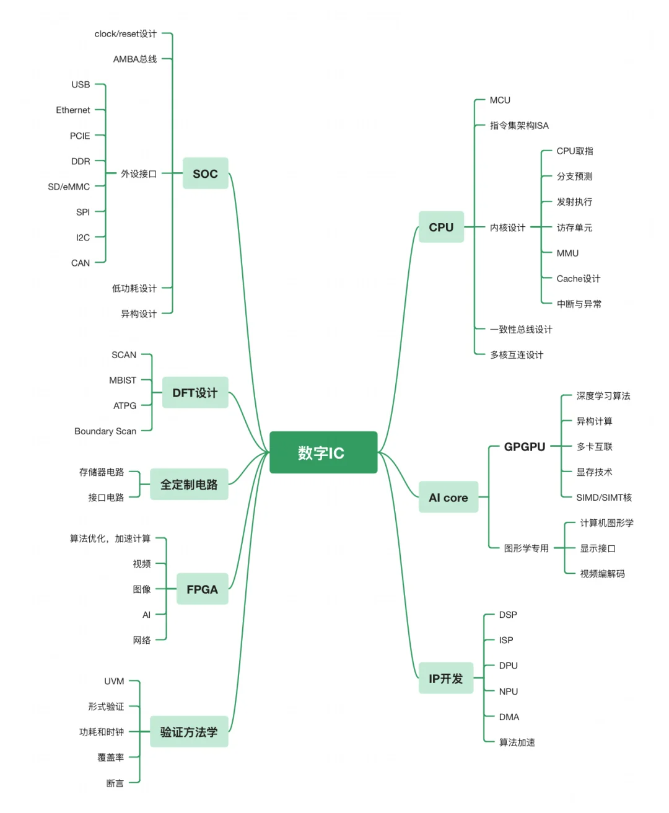

* 1经验：xhs/知乎/fpga探索者没事看看

  * [25届秋招总结——数字IC设计岗位，保持自信，坚定选择（关键词：引导面试官提问，项目熟烂于心，自信、坦诚、虚心、逻辑清晰）](https://mp.weixin.qq.com/s/eahvK0VHZL0X0jEvDGOASA)
  * [2024届秋招总结——秋招这一此生仅有的机会，不留遗憾](https://mp.weixin.qq.com/s/-de1XBHxDfEJ9wwoVE-fbw)
  * [25届数字IC秋招总结-CSDN博客](https://blog.csdn.net/zhuoxuanchen/article/details/144825056)
    * 蹲
  * [数字IC求职经验分享-24届小进 - 知乎](https://zhuanlan.zhihu.com/p/677811366)
    * 这个非常全面
* 2简历

  * 有时间可以再完善一下，看看别人的
* 3项目

  * 之前的项目
    * 通过文档和github回顾
    * 平时有时间看看别人的面经，融合自己的项目提出问题
  * 之后的项目
    * github
    * 文档
    * 博客？
* 4dead：八股文&手撕

  * [25实习必备——数字IC八股文集锦（FPGA底层资源；复位；数字IC设计流程；STA静态时序分析；分频；FIFO；亚稳态）](https://mp.weixin.qq.com/s?__biz=MzUyNTc4NTk0OA==&mid=2247519512&idx=1&sn=eec2969b32c72b43da6fba8252b20539&scene=21#wechat_redirect)

    * 这个我觉得可以寒假温习一下？
  * IC刷题小程序
  * 手撕

    * [【收藏】FPGA数字IC基础刷题Verilog代码及讲解（状态机、跨时钟、同步/异步FIFO、DMUX、奇数/小数分频）](https://mp.weixin.qq.com/s?__biz=MzUyNTc4NTk0OA==&mid=2247509081&idx=1&sn=6061e918f6f62e4bafb513bd3533a7a9&scene=21#wechat_redirect)
    * pdf
    * 这个其实问题不大，**只要把牛客里面那些题目刷完就行**
* 开源

  * https://github.com/WangXuan95?tab=repositories&q=&type=&language=&sort=stargazers
* 
