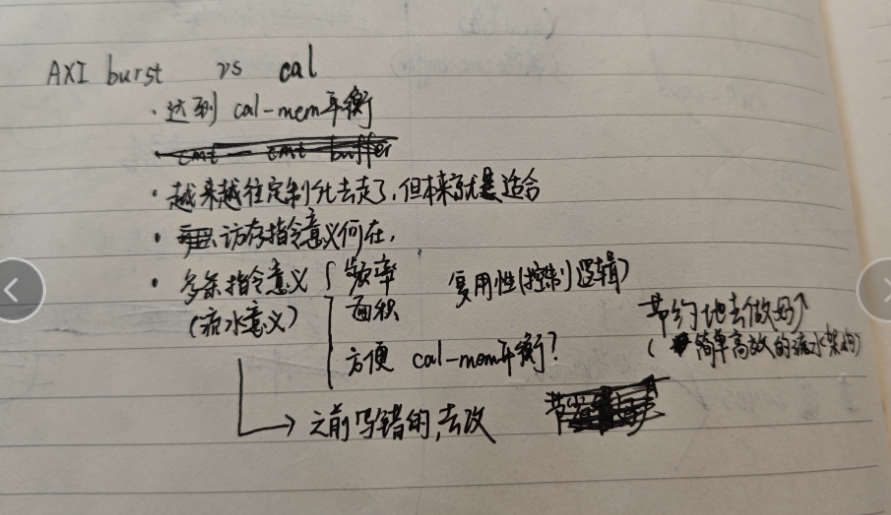

# 文章点

* ppvcu
* inst
* wino策略
* maxp策略
  * 似乎...
* 4.1
  * cache_line我可能要改一下，再说吧-偏向于不改
* 5.3
  * fpga数据

    * 板子型号不是官方，无妨
    * 另一个是频率
      * 使用宽松时钟约束(XCVU9P FPGA为50 MHz, 22FDX ASIC为500 MHz)生成的设计。在各自的Fmax112MHz时钟约束下，仅观察到适度的资源和面积增加
      * *现在直接说112MHz，师兄说的是先这样*
    * FF和Registers
      * *直接用Registers吧*
    * 资源那是SOC的因为后面的power是SOC的，所以这里的资源也用SOC的吧
    * 32bit和64bit的东西
      * survey应该是64，virtual应该是32
      * *直接用了，师兄说的是先放着*
* other

# 技术优化点

* 其实我的 ori-ppbuf 可以单拎出来写的，作为3.3......
* 0811的很多思考都很好：ppbuf还有升级版，2ld-1cal 代价是FF，好处是计算访存达到平衡【当然得先看axi延迟】

  
