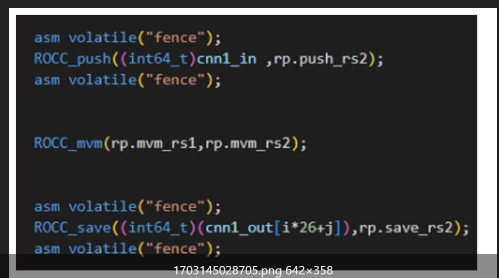

# 配置（待）

* 在lazy_rocc中添加自己的模块，并在subsystem/config中添加with，在chipyard的system中添加config
* 直接make config=xx（system/config），将会得到verilog文件和一些跑仿真需要的文件

  * 要运行PK的话，XS【1：0】可以直接在bootrom里改，也可以参考rocc_example那个脚本

# 代码

## 加速器内部

* 几个模块

  * HasLazyRoCCModule
    * router负责把cpu的cmd转发给各个加速器
    * respArb负责把加速器的响应转发给cpu
    * 还有个dcif(dcache接口)连接rocc的mem端口
  * haslazyRocc相当于是接口
  * LazyRoCCModuleImp是实现
  * lazyRocc是接口
* 有例子

  * 接口上的mem是直接连到L1 cache的，另外还有直接连到外存的接口(roccpdf26)
  * 把接口完善就行，可利用的是input的cmd(ready处理下)，要完善的是resp(valid和数据)

    * opcode作为参数引到module里
    * 每个加速模块内部用funt7和funct3区分不同指令
  * 还有访存的addr valid tag cmd

## 加速器与主核的连接

* 使用相关配置后，usingrocc会被打开，decodeTable中会添上roccDecode，bitpat进行匹配

  * 译码逻辑可以简单的想为 给一个bitpat，返回一系列信号值
  * table很容易看懂
* 在译码阶段若发现此时 rocc忙||流水线前有rocc指令，id_rocc_busy会拉高

  * 一种fence(导致id_stall)情况是id_rocc_busy，并且id段遇上一个fence指令，所以用这个可以起到隔离的作用

    * 
    * 还有一种是id有rocc，mem_busy并且id_reg_fence
  * ex或mem的rocc不能旁路，id段需要暂停

    * 如果指令已经送到rocc，似乎没有办法检测数据相关，此时应该手动添加fence指令（看上一条）
* ex阶段

  * rocc指令sel全为r2_zero和A1_RS1，给alu送去rs0和全0，fn是加法，结果则为rs0，后续送给接口；rs1则是会单独保存下来
* 写回阶段

  * 发现是一条custom指令，则拉高cmd的valid接口io.rocc.cmd.valid := wb_reg_valid && wb_ctrl.rocc &&!replay_wb_common
  * wb段rocc握手不成功，当拍replay_wb_rocc拉高，replay_wb,take_pc_wb相应拉高* replay_wb拉高会导致wbValid和wbWen低
  * take_pc_wb拉高会使take_pc_mem_wb高，进一步导致下一步ex和mem都不会valid
  * 直接看838行，**重新从这条开始取指执行**
* 访存

  * 接口是在hasLazyRoccModule中实现的
    * 可以结合着testharness看，想想怎么自动配置访存接口的；

      * 就是有个tile会继承这个模块，所以就实现了这个功能

        * valdcIF=Module(newSimpleHellaCacheIF()(outer.p))
        * dcIF.io.requestor <> rocc.module.io.mem
        * dcachePorts += dcIF.io.cache
    * 也可以直接看v代码了解这个访存转发机制
  * 师兄说的dma，还有上交那篇文章里提到的一种访存方式
* replay take_pc机制

## 软件

* 格式.insn `<format>` `<opcode>`, `<funct3>`, `<funct7>`, `<rd>`, `<rs1>`, `<rs2>`
* .h啥的就是包装一下
  * 也给了测试用例
  * 注意就是需要pk的话csr也得学学

# 点

* rocc.pdf提到了：可自动生成可配置的寄存器文件  scratchpad
