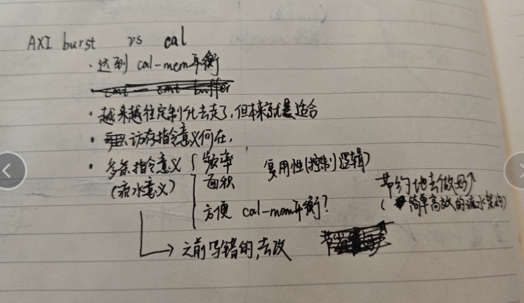

# 先按最简单的来弄

## 安排

* 其他

  * asic和fpga整理出需要的东西去问师兄，这个真别花时间在上面
    * hgh fpga：需要的话就看一下docker大小然后直接问hgh
  * 介绍和摘要
  * ckt 括号前后空格+大小写（table/pic/inst）+过去式【这个各自的部分吧，然后两个人互看下】

## 我干什么

* 待

  * 问：王学长你好，我们目前也在尝试运行CNN进行测试，看了你们的开源仓库https://github.com/QmppmQ/riscv中给出了lenet.c的源码，想问下你们工作中用到的另外两个CNN resnet18和vgg16有相应的代码和训练好的权重吗
  * 5.2需要算理论值？

    * wino不包括ld output
    * maxf还没算
  * 4.1那cache_line我可能要改一下，再说吧
* 这周

  * 19号

    * [X] 本子上那些待做的
      * [X] ldtile
      * [X] maxf
    * [X] 初稿前ckt我自己写的地方，毕竟改了好多次
      * [X] 只改错误的说法
    * [ ] 查看cva6预留指令编码，尽量还是用custom，然后在文章里相应位置改动
  * 实验再说

    * 要有时间再自己做一下实验吧【要想着能力提升，不是为了完成任务】
  * 后续

    * 其实我的 ori-ppbuf 可以单拎出来写的，作为3.3......
    * 0811的很多思考都很好：ppbuf还有升级版，2ld-1cal 代价是FF，好处是计算访存达到平衡【当然得先看axi延迟】

      

# 非必要实验

* 模拟器【DEBUG要有抽离性】【差不多得了，因为RTL才是真】

  * 实现ppbuf

    * 调试性能
  * 滑窗法

    * DEBUG【指令序列啥的】
    * 跑三个网络【其实vgg没必要】
  * 加速法

    * 记得换成滑窗+wino
  * 池化层效果测试

    * 编译器
    * 内联
    * debug
    * 跑池化层测试
* RTL搞好也是一种学习，verilator仿真弄好可以让他去综合

  * 参考下面的点

# 一些遗留

* 文章中的细节

  * 各部件应该是能同时计算的-可能需要看RTL源码
    * 就算不能我也不一定改文章
  * 旁路和那个操作数选择的细节就不写了

## 模拟器

* other

  * 虚地址错误大概是 padding & stride=2导致的
  * 脚本混乱，脚本说明在runGem5中
    * sortdata里面的玩意儿

## RTL-算是deprecated-可以放在初稿之后-白纸上有些笔记

* oacc对于src2需要加个偏移
* 已完成

  * 译码
  * ACC computing-unit
    * 流水级-互锁
    * 操作数选择
* 功能性能测试都再说

  * 要跑的话编译器那得改动
  * 借机搭一下差分测试？
  * 看perf.txt可以参考些东西
