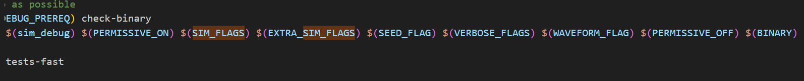

# ENV

* ubuntu的docker中运行
  * cd ~/sims/verilator && source env.sh
* 测试样例直接在tests里make就有，.h文件和汇编那些都有了
  * 但是没有pk的，得rocc_example里才有
* 波形图在docker里不知道咋打开，建议vscode操作复制到mnt下，在ubuntu里打开
  * 波形图记得删除
* 完了docker里不知道咋用ccache，算了，而且内存也不够
* docp - sims/verilator/mnt：docp是新容器上的挂载
* dockerCp保存了老容器上的一些东西

# 流程

* 看rockie.md进行配置
* make（make CONFIG=XXConfig run-binary-debug “BINARY=pk xx"）

  * 只有简单的程序才能直接在裸机上跑
  * 复杂的要在pk上，“BINARY=pk xx”
  * 不带波形
    * mkdir -p ./output/chipyard.TestHarness.LCMAccelRocketConfig && set -o pipefail &&  /root/chipyard/sims/verilator/simulator-chipyard-LCMAccelRocketConfig-debug +permissive +dramsim +dramsim_ini_dir=/root/chipyard/generators/testchipip/src/main/resources/dramsim2_ini +max-cycles=10000000   +verbose +permissive-off pk lcm </dev/null 2> >(spike-dasm > ./output/chipyard.TestHarness.LCMAccelRocketConfig/pk_lcm.out) | tee ./output/chipyard.TestHarness.LCMAccelRocketConfig/pk_lcm.log
* ./xxx和make help可以查看帮助，make xxx -n可以展开

  * fst应该小一点，log是终端输出，out是指令序列
* 波形图复制到mnt，在ubuntu里打开

# rocket编译的一些解释

* make
  * 直接在sub_project里面指定即可，默认是chipyard
    * MODEL   可以理解为测试框架
    * TOP		是实际的顶层文件
  * 可以指定CONFIG等参数，生成的东西在generated-src/long-name里
  * 先生成makefile片段，再用makefile生成我们的可执行文件
* run-binary-debug
  * 
  * SIM_FLAGS += +dramsim +dramsim_ini_dir=xx +max-cycles=(timeout_cycles)
  * -V或者--verbose会被展开成 +verbose，代表输出详细信息
  * -v紧跟着波形文件的路径
  * 完全体(set -o pipefail &&  /root/chipyard/sims/verilator/simulator-chipyard-LCMAccelRocketConfig-debug +permissive +dramsim +dramsim_ini_dir=/root/chipyard/generators/testchipip/src/main/resources/dramsim2_ini +max-cycles=10000000   +verbose -v/root/chipyard/sims/verilator/output/chipyard.TestHarness.LCMAccelRocketConfig/pk_lcm.vcd +permissive-off pk lcm </dev/null 2> >(spike-dasm > /root/chipyard/sims/verilator/output/chipyard.TestHarness.LCMAccelRocketConfig/pk_lcm.out) | tee /root/chipyard/sims/verilator/output/chipyard.TestHarness.LCMAccelRocketConfig/pk_lcm.log)
* 架构应该看chipyard下的
  * testharness中会用到buildtop
  * buildtop往下？
* tile
  * sys

    * 不同的config用到了subsys里不同的配置withXX
  * subsys

    * 写了一些withXX，继承自config，我理解是将一些配置添加到全局里
      * 这里关键的是每个withXX都使用了case X=>（例如case BuildRocc）
      * withLazyRocc里使用了p隐式参数
  * rocketTile

    * 继承了haslzayRocc等，把自己作为参数实例化了RocketTileModuleImp
    * **haslazyRocc里有用到BuildRocc，对比withLazyRocc看一下就知道是什么意思**
      * haslazyrocc个人感觉是接口
    * RocketTileParams是实例化rocketTile的一个参数
  * RocketTileModuleImp

    * 继承了haslzayRoccMImp，实例化了core
      * haslzayRoccMImp是实现，包括resparb，cmdrouter
* buildRocc
