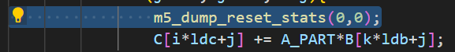
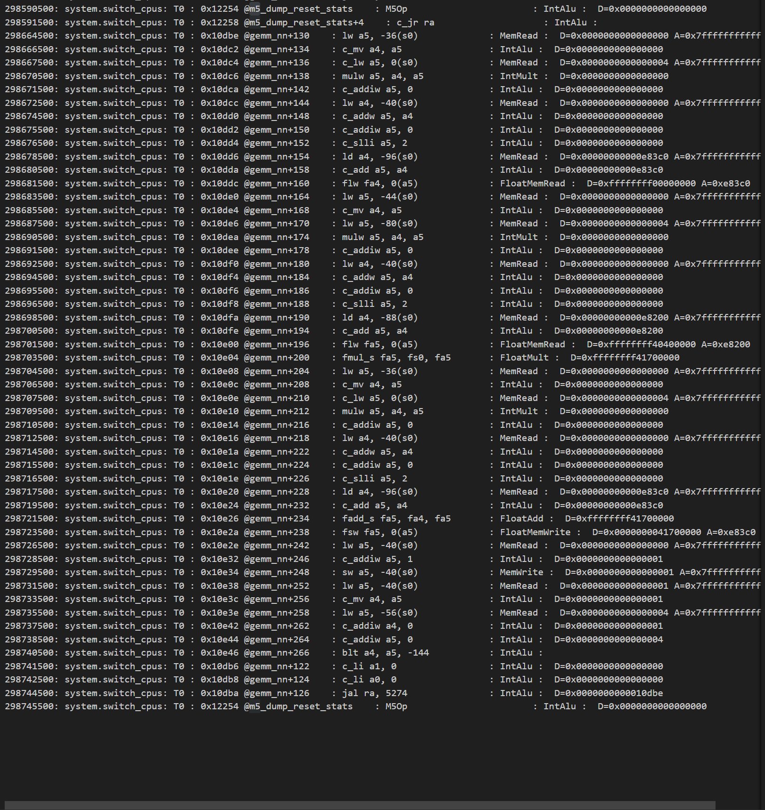
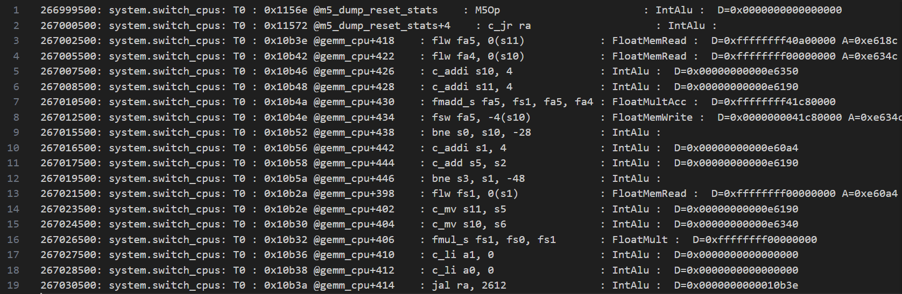

# 卷积

## darknet：col+gemm

* 开-O2能省去很多代码【好像是-Ofast，雾
  
  
  

* 研究gemm所得：0229 0845-1012
  * 发现第二个lw总是长时间处在DS
    * 看log memDep显示waking...
    * 到对应代码下去看，发觉应该和前面的store有关
    * 在到store的log去查看，可以看到store添加了这lw(以及下面一个sw)到他的depende列表里
    * 结合searching for producing的代码，发觉可能是一个错误的访存预测导致了这个结果
    * 虽说是个无聊的bug，但是也熟悉了代码

## favour：winograd

* winograd5的im2col用fast和O2没啥区别，直接在O2上分析
  * 向量扩展去做也挺好的，不知道编译上如何支持，以及gem5是否支持
    * gem5是支持RVV，输出里有RVV enabled VLEN ELEN可以顺着代码看下
    * 记得老师也说过可以去看看RVV做得不好的地方
    * 也就是说就算gem5支持，也可以模仿他的改一下
  * 或者，想点新奇的招数？

* winograd5的Ofast比O2快很多
  * Ofast
    * multi他是有行列边界的判断，所以其实是有点浪费，这里其实写一个for循环做乘法会更好
      * 用向量乘替代，同时向量乘可能也可以用到转置卷积中，问题又回到了向量扩展的问题上
      * 当然这里可以直接把multi和后面的结合起来做，多周期就是了

# 扩张卷积

## darknet：

# 转置卷积

## darknet：deconv？

## caffe：fcn？

## diy：build by uself

# 可形变卷积
