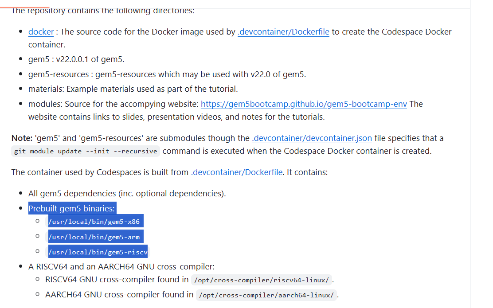

# GENE

1. 小程序段性能调优 --- 大程序功能验证
2. 方法论

   1. 目前使用reset可以把输出截断，优化等级就用-O2
   2. 要切分基本块的话，感觉借助模拟器的输出pc写个python脚本应该不难实现
   3. 乱序内部结构不了解，不便分析，可以选择

      1. GEM5学习：ckpt  +  debugging +  statics  +  tracingCPU
      2. 了解gem5乱序，找瓶颈
      3. vscode gdb
3. 各维度

   1. 卷积：目前是 `col+gemmING`,`winogradING` ~~vectorized~~待，也可以都搞
   2. `dilated_conv`有在darknet上现成的开源，待
   3. `transpose_conv`例如fcn有在caffe上实现
      1. 学caffe工作量大，不过darknet是个好的入手点
      2. 也可以看着源码来搭建？-darknet里可能已经有 `deconv`
      3. 亦或是做一个简单的demo单纯验证功能性，到后期在尝试跑大的网络
   4. `deformable_conv`量大，可能会是个好点，不过估计不好验证
4. 想到的点

   1. gemm找到gem5中一个依赖性预测bug（详见memdep里的pre啥的，根据pc查表，有论文），然后发现有错误的预测导致sw后的lw发射过晚
   2. im2col要结合col2im分析，涉及到load-store这样的指令，可以设计扩展指令
      1. 如果是V扩展，自己还在看gem5的实现
         1. 找RVV不足,改动;
      2. 不知道
   3. WINO5可能把那块给用一条扩展指令给做了，那一块是对矩阵也就是数组操作，但其实那个算子里数组是很小的，完全可以避免一些没必要的sw，同时减少指令数量
      1. 有人做过，但是他是一维，操作少，直接一条指令做完
      2. 我是二维，二维要把基础算法在大矩阵上累加啥的吧
         1. 我就是对基本算法中的一部分进行优化
   4. 稀疏-流水-pingpong
   5. 大矩阵拆分
5. Q

   1. 先扩展指令，再进行数据流的优化才比较合理吧，有些地方可能加上扩展指令就没那么多问题了
      1. 所以先别急着分析
6. now

   1. 中期前
      1. 服务器要下下周，在那之前两种方法都可以试下：

         1. 可能要把 `所有代码zip和konata`压缩下来让他传
         2. 不知道这个网页[gem5bootcamp/gem5-bootcamp-env (github.com)](https://github.com/gem5bootcamp/gem5-bootcamp-env)上的有没有用，毕竟有prebuilt好的玩意儿，可能可以直接跑？
      2. gemm【这个不太急，或者说不是大点】

         1. 改好毛病，**跑图，对比tick**
      3. im2col和col2im【大点】

         1. **就突然有了挺多想法，看看纸上**
            1. 明天查一查有没有人做过
            2. 可能那些for都不需要，改为设置reg值
            3. 全部的im2col，col2im都看看
               1. wino的倒还好
               2. darknet里那个还蛮复杂的，各种情况，看他的asm便可得出
            4. 分析的部分可以写在论文里
            5. v扩展大概是不会去做了，所以v的先放下，当然那些资料啥的也挺好的，有时间可以看看
               1. ~~simd~~
                  1. ~~riscv-v-spec+计算所那个【周一】~~
                  2. ~~gem5里是怎么样的，有没有人做过~~
                  3. ~~想想怎么实现，可能要动动手~~
               2. ~~burst~~
         2. **跑图，对比tick**
      4. wino5【中点】

         1. 那个是最核心的循环，除了循环里那部分，还可以再看看trace分析，不看也就算了【周一】
         2. 加指令
            1. 看看gem5官网，那个教程，还有计算所那个
            2. **跑图，对比tick**
      5. 写写报告
   2. 最后阶段
      1. 看看中期做的效果吧
      2. 上面3个点也差不多够了，看情况可以考虑
         1. 加上 ③扩张和④转置，
            1. 做这四个的通用，或者每个都有个点
            2. 可形变是一个美好的愿景
            3. wino3和wino4有通用的部分，就是一维wino，看看有没有必要做，然后可能也有一些其他的点
               1. 还有就是有没有必要，毕竟wino其实只需要一种就好了
      3. **完整的实验对比啥的**
      4. 写论文
